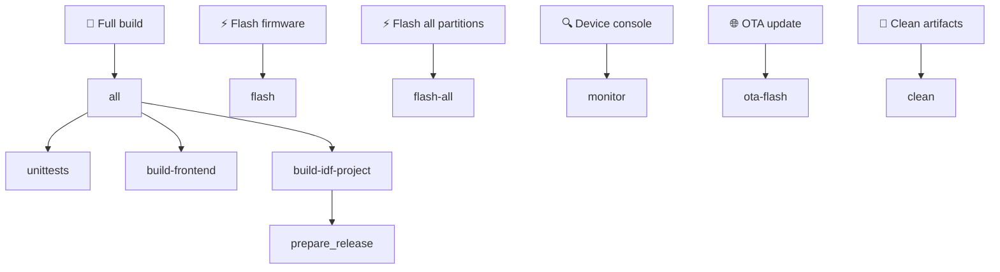
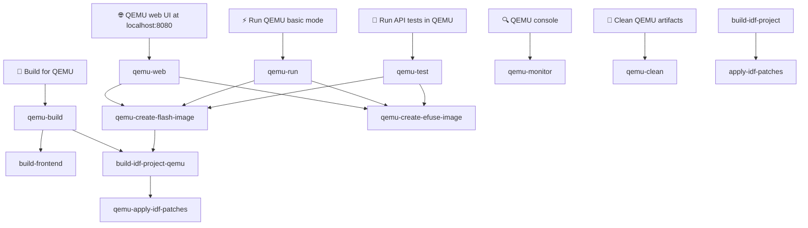

# WB-MGE
Wiren Board Multiprotocol Gateway

## Project Description

WB-MGE is designed to connect devices with RS-485 interface and WBIO I/O side modules to an automation server via Ethernet or Wi-Fi.

Two modes are available for each port:

 - Modbus TCP — for Modbus devices only
 - Transparent gateway — suitable for any protocols running over RS-485.

## Manual Build Instructions

### Prerequisites

1. **Node.js 20.x** (version 20.x is required)
2. **Python 3.8+** (version 3.8 or higher is required)
3. **Git**

**Note:** These instructions are for Debian/Ubuntu systems

### 1. Install Node.js 20.x

```bash
curl -fsSL https://deb.nodesource.com/setup_20.x | sudo -E bash -
sudo apt-get install -y nodejs
```

### 2. Install EIM (ESP-IDF Installation Manager)

Debian:
```bash
echo "deb [trusted=yes] https://dl.espressif.com/dl/eim/apt/ stable main" | sudo tee /etc/apt/sources.list.d/espressif.list
sudo apt update
sudo apt install eim-cli
```

RPM-Based Linux:
```bash
sudo tee /etc/yum.repos.d/espressif-eim.repo << 'EOF'
[eim]
name=ESP-IDF Installation Manager
baseurl=https://dl.espressif.com/dl/eim/rpm/$basearch
enabled=1
gpgcheck=0
EOF

sudo dnf install eim-cli
```

MacOS:
```bash
brew tap espressif/eim
brew install eim
```


### 3. Install ESP-IDF


```bash
eim install -i v5.4
```

### 4. Clone the Repository

```bash
git clone git@github.com:wirenboard/wb-mge.git
cd wb-mge
```

### 5. Build the Project

For a complete build (unit tests + frontend + firmware):

```bash
make
```

If building components separately, first build the frontend:

```bash
make build-frontend
```

Then build the firmware:

```bash
make build-idf-project
```

## Make Dependency Graph





## Building with Docker

Docker allows you to build the project without installing ESP-IDF and Node.js on your host system.

### 0. Install Docker

Install Docker according to the official documentation for your OS:
https://docs.docker.com/desktop/setup/install/linux/

### 1. Build Docker Image

```bash
# From the project root directory
docker build -t wb-mge-builder .
```

This will create a Docker image with:
- ESP-IDF v5.4
- Node.js 20.x
- All necessary build tools

### 2. Run Container

```bash
docker run --rm -it -v $(pwd):/root/esp/project wb-mge-builder
```

### 3. Build Inside Container

Building inside the container is the same as manual building (see "Manual Build Instructions" section, step 3).

### Alternative: One-Command Build

You can build the project without entering the container:

```bash
docker run --rm -v $(pwd):/root/esp/project wb-mge-builder make
```

> **Note:** After running `docker run … make`, artifacts in `build/` and `release/` are owned by root.
> Use `sudo make clean` or `sudo rm -rf build release` before any subsequent host build.

## Flashing the Device

```bash
make flash
```

To flash all partitions explicitly (bootloader, partition table, OTA data, app):

```bash
make flash-all
```

## Connecting to Device Console

```bash
make monitor
```

To disconnect from the monitor, press `Ctrl+]`.

## Cleanup

```bash
make clean
```

Or inside container:

```bash
docker run --rm -v $(pwd):/root/esp/project wb-mge-builder make clean
```

Remove Docker image:
```bash
docker rmi wb-mge-builder
```

## Test infrastructure setup from scratch (Debian 13)

Steps to provision a clean Debian 13 (trixie) host to build the QEMU firmware and run the `api_tests/` suite end-to-end. Performed as `root`.

### 1. OS packages

```bash
apt-get update
apt-get install -y --no-install-recommends \
    ca-certificates curl gnupg lsb-release \
    git make cmake ninja-build \
    python3 python3-pip python3-venv \
    libusb-1.0-0 libssl-dev libffi-dev \
    libsdl2-2.0-0 libpixman-1-0 libslirp0 libglib2.0-0 \
    file flex bison gperf wget xz-utils dfu-util
```

### 2. Node.js 20.x

```bash
curl -fsSL https://deb.nodesource.com/setup_20.x | bash -
apt-get install -y nodejs
```

### 3. ESP-IDF v5.4 via EIM (Espressif Installation Manager)

Add the official EIM apt repository and install `eim-cli`:

```bash
echo "deb [trusted=yes] https://dl.espressif.com/dl/eim/apt/ stable main" \
    > /etc/apt/sources.list.d/espressif.list
apt-get update
apt-get install -y eim-cli
```

Install ESP-IDF (uses `/var/tmp/eim-work` as scratch space to avoid filling `/tmp`):

```bash
mkdir -p /var/tmp/eim-work
TMPDIR=/var/tmp/eim-work eim install --idf-versions v5.4 --target esp32 --non-interactive true -v
```

After install, ESP-IDF lives in `/root/.espressif/v5.4/esp-idf` and is activated with:

```bash
source /root/.espressif/tools/activate_idf_v5.4.sh
```

### 4. QEMU xtensa

EIM does not install QEMU. Use `idf_tools.py` from the activated environment:

```bash
source /root/.espressif/tools/activate_idf_v5.4.sh
python "$IDF_PATH/tools/idf_tools.py" install qemu-xtensa
```

This places the binary at `/root/.espressif/tools/tools/qemu-xtensa/esp_develop_*/qemu/bin/qemu-system-xtensa`, which the `make qemu-*` targets discover automatically.

### 5. Clone the repository

```bash
cd /root
git clone https://github.com/wirenboard/wb-mge.git
cd wb-mge
```

### 6. Python virtualenv for `api_tests/`

```bash
python3 -m venv api_tests/.venv
api_tests/.venv/bin/pip install -r api_tests/requirements.txt
```

The `make qemu-test` target invokes `api_tests/.venv/bin/python` directly, so the venv must live at `api_tests/.venv`.

### 7. Build firmware + frontend and run tests

Build everything for QEMU (frontend + firmware with QEMU config):

```bash
cd /root/wb-mge
make qemu-build
```

Generate flash and eFuse images:

```bash
make qemu-create-flash-image
make qemu-create-efuse-image
```

Run the API test suite (boots QEMU, runs pytest, kills QEMU):

```bash
make qemu-test
```

Filter tests by name:

```bash
make qemu-test PYTEST_ARGS="-k test_auth"
```

Run QEMU with web UI at http://localhost:8080:

```bash
make qemu-web
```

If a previous QEMU run left a stale process, kill it before retrying:

```bash
pkill -9 -f qemu-system-xtensa
```

### Notes

- Initial run downloads ~2 GB of toolchains/components (EIM + xtensa toolchain + IDF managed components); expect ~10 minutes on a fresh host.
- ESP-IDF tools occupy ~5 GB under `/root/.espressif`. Allocate at least 15 GB of free disk before starting.
- `make qemu-create-flash-image` depends on `build-idf-project-qemu` and compiles QEMU firmware (incremental) before merging images. If `build/` contains a hardware build, it automatically runs `fullclean` and rebuilds for QEMU.
