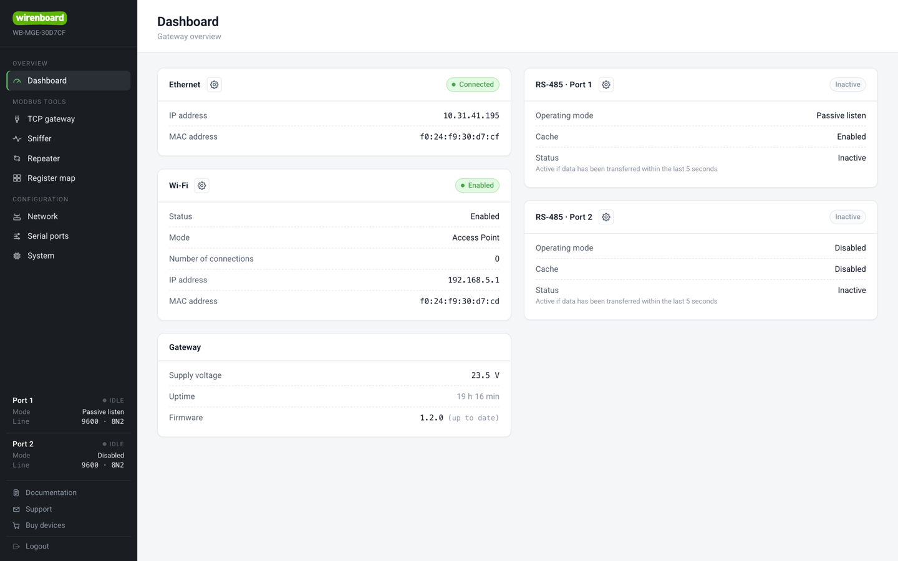
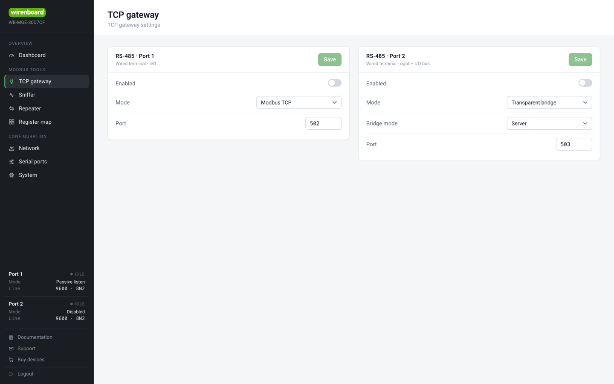
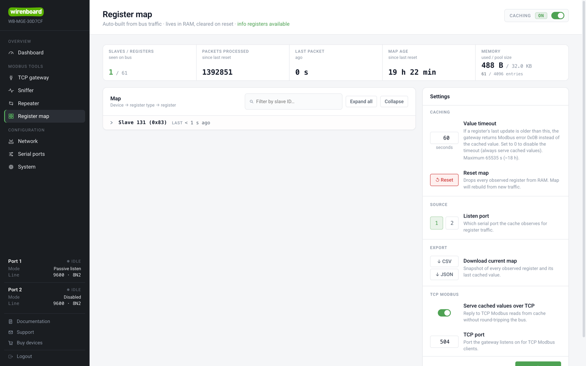
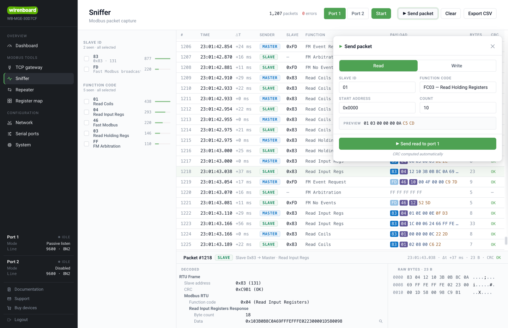
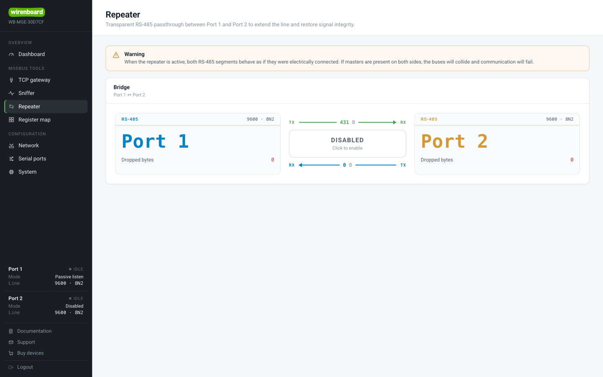
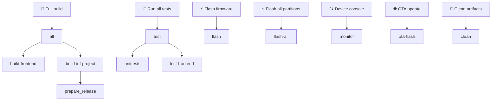
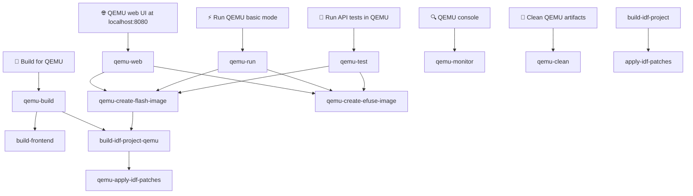

# WB-MGE
Wiren Board Multiprotocol Gateway

## Project Description

WB-MGE is designed to connect devices with RS-485 interface and WBIO I/O side modules to an automation server via Ethernet or Wi-Fi.

All functions described below are configured and monitored through the built-in web interface:



Two modes are available for each port:

 - **Modbus TCP** — for Modbus devices only: a full **Modbus TCP ↔ Modbus RTU** converter.
   Toward the network the gateway acts as a Modbus TCP server, and on the RS-485 bus as a Modbus
   RTU master: it strips the MBAP header from the TCP request, builds an RTU frame (appends the
   CRC), polls the device and wraps the RTU reply back into Modbus TCP.
 - **Transparent gateway** — suitable for any protocols running over RS-485; bytes are forwarded
   as-is, without frame parsing. It can run as a TCP **server** (waits for incoming connections)
   or a TCP **client** (connects out to a remote `ip:port`).

   

   *Each port is switched independently between **Modbus TCP** and **Transparent bridge**
   (server/client) on the TCP gateway page.*

On top of either mode, each port can additionally enable:

 - **Cache (Cache TCP)** — passively tracks the Modbus traffic on the bus, stores the latest
   register and coil values and serves them over a dedicated Modbus TCP server without
   re-polling the devices (a "from cache" reply). Also exposed via `GET /cache/json` and `/cache/csv`.

   

   *The **Register map** page shows the cache auto-built from observed bus traffic, the value
   timeout and reset controls, CSV/JSON export, and the Modbus TCP server (port 504) that replies
   straight from cache.*

 - **Sniffer** — captures RS-485 traffic in both directions, decodes Modbus frames and streams
   them to the web UI over WebSocket for diagnostics.

   

   *Press **Start** to stream live decoded frames (filter by Slave ID / function code, click a
   row to decode it); the **Send packet** tool builds and injects read (FC01–FC04) and write
   (FC05/06/15/16) requests with an automatically computed CRC and a live frame preview.*

Separately, both ports together can run as a:

 - **Repeater** — a transparent serial-to-serial passthrough that links the two RS-485 ports
   directly to each other instead of to the network: bytes received on Port 1 are forwarded to
   Port 2 and vice versa, as-is, without frame parsing. It is used to extend the RS-485 line and
   restore signal integrity. The mode activates only when **both** ports are switched to repeater
   mode; the *Repeater* page of the web UI shows live forwarding statistics — bytes forwarded in
   each direction, dropped bytes per port, uptime and average throughput (the raw counters are
   also exposed under the `repeater` object of `GET /info`). **Warning:** while the repeater is
   active, the two segments behave as if they were electrically connected — if a master is present
   on both sides, the buses collide and communication fails.

   

   *The Repeater page shows the enable toggle and live forwarding statistics; the mode activates
   only when both ports are switched to repeater mode.*

## Device Register Map (Unit ID 255)

The gateway itself answers Modbus polls on its own address **Unit ID 255 (0xFF)** — per the
Modbus Messaging Implementation Guide this address is reserved for the TCP gateway itself.
It works in both **Modbus TCP** and **Cache TCP** modes, regardless of cache state (in Modbus
TCP mode such a request is NOT forwarded to RS-485). Read functions **FC04** (input) and
**FC03** (holding) are supported.

### Input registers (FC04, read-only)

| Address (dec) | Address (hex) | Regs | Type   | Description                                                         |
|---------------|---------------|------|--------|---------------------------------------------------------------------|
| 104–105       | 0x0068–0x0069 | 2    | u32    | Uptime since boot, seconds                                          |
| 121           | 0x0079        | 1    | u16    | Current supply voltage, mV                                          |
| 200–219       | 0x00C8–0x00DB | 20   | string | Device model                                                        |
| 220–244       | 0x00DC–0x00F4 | 25   | string | Commit hash and branch the firmware was built from                  |
| 250–265       | 0x00FA–0x0109 | 16   | string | Firmware version (string)                                           |
| 266–269       | 0x010A–0x010D | 4    | u64    | Serial number extension                                             |
| 270–271       | 0x010E–0x010F | 2    | u32    | Serial number                                                       |
| 320           | 0x0140        | 1    | u16    | Firmware version: MAJOR                                             |
| 321           | 0x0141        | 1    | u16    | Firmware version: MINOR                                             |
| 322           | 0x0142        | 1    | u16    | Firmware version: PATCH                                             |
| 323           | 0x0143        | 1    | s16    | Firmware version: SUFFIX (+N for `+wbN`, −N for `-rcN`, 0 if none)  |
| 324–325       | 0x0144–0x0145 | 2    | u32    | Numeric firmware version (little-endian word order: 324 = low word) |
| 326–327       | 0x0146–0x0147 | 2    | u32    | Numeric firmware version (big-endian word order: 326 = high word)   |
| 337–338       | 0x0151–0x0152 | 2    | u32    | Packets processed (since last cache reset)                          |
| 339–340       | 0x0153–0x0154 | 2    | u32    | Seconds since the last packet on the bus                            |
| 341           | 0x0155        | 1    | u16    | Devices currently on the bus (unique slave_ids in cache)            |
| 342           | 0x0156        | 1    | u16    | Average bus poll rate, polls/min                                    |
| 343           | 0x0157        | 1    | u16    | Cache value timeout, seconds                                        |
| 65504         | 0xFFE0        | 1    | u16    | Maximum used stack, KB (0 = stack corrupted / unknown)              |
| 65505         | 0xFFE1        | 1    | u16    | Free RAM, KB                                                        |
| 65506         | 0xFFE2        | 1    | u16    | Used RAM, KB                                                        |
| 65507         | 0xFFE3        | 1    | u16    | Stack size, KB                                                      |
| 65508         | 0xFFE4        | 1    | u16    | Last MCU reboot reason                                              |

### Holding registers (FC03, read-only)

| Address (dec) | Address (hex) | Regs | Type   | Description        |
|---------------|---------------|------|--------|--------------------|
| 290–301       | 0x0122–0x012D | 12   | string | Firmware signature |

### Register map notes

- **Strings**: 2 characters per register, high byte = first character; the tail is zero-padded.
- **Multi-register integers** (except 324–325) use big-endian word order — the most significant
  word is at the lower register address.
- **Numeric version** is computed per the Wiren Board rule
  ([wiki](https://wiki.wirenboard.com/wiki/Modbus-hardware-version)):
  `if (SUFFIX >= 0) enc = SUFFIX + 128; else enc = -1 - SUFFIX;`
  `VERSION = (MAJOR << 24) | (MINOR << 16) | (PATCH << 8) | enc`.
- **Reboot reason** (65508): 1 — LPWR (brownout / wake from sleep), 2 — WWDG (interrupt
  watchdog), 3 — IWDG (task / generic watchdog), 4 — SFT (software reset / panic), 5 — POR
  (power-on), 6 — PIN (external reset), 0 — unknown. Mapped from `esp_reset_reason()`.
- **Bus statistics** (337–343) come from the multimaster cache; with the cache inactive these
  fields read as 0. Register 336 (0x0150) is intentionally skipped: it is the last register of
  the standard Wiren Board bootloader-version field (330–336), so it is left undefined here.
- Reading a range where at least one address is undefined returns exception **0x02** (illegal
  data address); a function other than FC03/FC04 returns exception **0x01** (illegal function).

## CI

Builds run on Jenkins at <https://jenkins.wirenboard.com/job/wirenboard/job/wb-mge/>.
See [docs/jenkins_wb.md](docs/jenkins_wb.md) for API token setup and commands
to query build status / logs from the shell.

## Manual UI Test Procedures

Manual UI verification scenarios. Each document contains step-by-step procedures with
expected outcomes.

- [docs/ui_smoke_test.md](docs/ui_smoke_test.md) — high-level visual smoke test of the
  whole web UI: every menu page opens, buttons react, forms accept input, mobile
  viewport works. Russian.

## Manual Build Instructions

### Prerequisites

1. **Node.js 20.x** (version 20.x is required)
2. **Python 3.8+** (version 3.8 or higher is required)
3. **Git**

**Note:** These instructions are for Debian/Ubuntu systems

### 1. Install Node.js 20.x

```bash
curl -fsSL https://deb.nodesource.com/setup_20.x | sudo -E bash -
sudo apt-get install -y nodejs
```

### 2. Install EIM (ESP-IDF Installation Manager)

Debian:
```bash
echo "deb [trusted=yes] https://dl.espressif.com/dl/eim/apt/ stable main" | sudo tee /etc/apt/sources.list.d/espressif.list
sudo apt update
sudo apt install eim-cli
```

RPM-Based Linux:
```bash
sudo tee /etc/yum.repos.d/espressif-eim.repo << 'EOF'
[eim]
name=ESP-IDF Installation Manager
baseurl=https://dl.espressif.com/dl/eim/rpm/$basearch
enabled=1
gpgcheck=0
EOF

sudo dnf install eim-cli
```

MacOS:
```bash
brew tap espressif/eim
brew install eim
```


### 3. Install ESP-IDF


```bash
eim install -i v5.4
```

### 4. Clone the Repository

```bash
git clone git@github.com:wirenboard/wb-mge.git
cd wb-mge
```

### 5. Build the Project

For a complete build (frontend + firmware):

```bash
make
```

To run all tests (C unit tests + frontend tests):

```bash
make test
```

If building components separately, first build the frontend:

```bash
make build-frontend
```

Then build the firmware:

```bash
make build-idf-project
```

## Make Dependency Graph





## Building with Docker

Docker allows you to build the project without installing ESP-IDF and Node.js on your host system.

### 0. Install Docker

Install Docker according to the official documentation for your OS:
https://docs.docker.com/desktop/setup/install/linux/

### 1. Build Docker Image

```bash
# From the project root directory
docker build -t wb-mge-builder .
```

This will create a Docker image with:
- ESP-IDF v5.4
- Node.js 20.x
- All necessary build tools

### 2. Run Container

```bash
docker run --rm -it -v $(pwd):/root/esp/project wb-mge-builder
```

### 3. Build Inside Container

Building inside the container is the same as manual building (see "Manual Build Instructions" section, step 3).

### Alternative: One-Command Build

You can build the project without entering the container:

```bash
docker run --rm -v $(pwd):/root/esp/project wb-mge-builder make
```

> **Note:** After running `docker run … make`, artifacts in `build/` and `release/` are owned by root.
> Use `sudo make clean` or `sudo rm -rf build release` before any subsequent host build.

## Flashing the Device

```bash
make flash
```

To flash all partitions explicitly (bootloader, partition table, OTA data, app):

```bash
make flash-all
```

## Connecting to Device Console

```bash
make monitor
```

To disconnect from the monitor, press `Ctrl+]`.

## Cleanup

```bash
make clean
```

Or inside container:

```bash
docker run --rm -v $(pwd):/root/esp/project wb-mge-builder make clean
```

Remove Docker image:
```bash
docker rmi wb-mge-builder
```

## Test infrastructure setup from scratch (Debian 13)

Steps to provision a clean Debian 13 (trixie) host to build the QEMU firmware and run the `api_tests/` suite end-to-end. Performed as `root`.

### 1. OS packages

```bash
apt-get update
apt-get install -y --no-install-recommends \
    ca-certificates curl gnupg lsb-release \
    git make cmake ninja-build \
    python3 python3-pip python3-venv \
    libusb-1.0-0 libssl-dev libffi-dev \
    libsdl2-2.0-0 libpixman-1-0 libslirp0 libglib2.0-0 \
    file flex bison gperf wget xz-utils dfu-util
```

### 2. Node.js 20.x

```bash
curl -fsSL https://deb.nodesource.com/setup_20.x | bash -
apt-get install -y nodejs
```

### 3. ESP-IDF v5.4 via EIM (Espressif Installation Manager)

Add the official EIM apt repository and install `eim-cli`:

```bash
echo "deb [trusted=yes] https://dl.espressif.com/dl/eim/apt/ stable main" \
    > /etc/apt/sources.list.d/espressif.list
apt-get update
apt-get install -y eim-cli
```

Install ESP-IDF (uses `/var/tmp/eim-work` as scratch space to avoid filling `/tmp`):

```bash
mkdir -p /var/tmp/eim-work
TMPDIR=/var/tmp/eim-work eim install --idf-versions v5.4 --target esp32 --non-interactive true -v
```

After install, ESP-IDF lives in `/root/.espressif/v5.4/esp-idf` and is activated with:

```bash
source /root/.espressif/tools/activate_idf_v5.4.sh
```

### 4. QEMU xtensa

EIM does not install QEMU. Use `idf_tools.py` from the activated environment:

```bash
source /root/.espressif/tools/activate_idf_v5.4.sh
python "$IDF_PATH/tools/idf_tools.py" install qemu-xtensa
```

This places the binary at `/root/.espressif/tools/tools/qemu-xtensa/esp_develop_*/qemu/bin/qemu-system-xtensa`, which the `make qemu-*` targets discover automatically.

### 5. Clone the repository

```bash
cd /root
git clone https://github.com/wirenboard/wb-mge.git
cd wb-mge
```

### 6. Python virtualenv for `api_tests/`

```bash
python3 -m venv api_tests/.venv
api_tests/.venv/bin/pip install -r api_tests/requirements.txt
```

The `make qemu-test` target selects the Python interpreter via `PYTEST_PYTHON`: it prefers
`api_tests/.venv/bin/python` (developer workflow) and falls back to `/opt/api_tests_venv/bin/python`
(CI/Docker image, where the venv is pre-baked). Override with `make qemu-test PYTEST_PYTHON=/path/to/python` if needed.

### 7. Build firmware + frontend and run tests

Build everything for QEMU (frontend + firmware with QEMU config):

```bash
cd /root/wb-mge
make qemu-build
```

Generate flash and eFuse images:

```bash
make qemu-create-flash-image
make qemu-create-efuse-image
```

Run the API test suite (boots QEMU, runs pytest, kills QEMU):

```bash
make qemu-test
```

Filter tests by name:

```bash
make qemu-test PYTEST_ARGS="-k test_auth"
```

Run QEMU with web UI at http://localhost:8080:

```bash
make qemu-web
```

If a previous QEMU run left a stale process, kill it before retrying:

```bash
pkill -9 -f qemu-system-xtensa
```

### Notes

- Initial run downloads ~2 GB of toolchains/components (EIM + xtensa toolchain + IDF managed components); expect ~10 minutes on a fresh host.
- ESP-IDF tools occupy ~5 GB under `/root/.espressif`. Allocate at least 15 GB of free disk before starting.
- `make qemu-create-flash-image` depends on `build-idf-project-qemu` and compiles QEMU firmware (incremental) before merging images. If `build/` contains a hardware build, it automatically runs `fullclean` and rebuilds for QEMU.

## Permanently Disabling Wi-Fi

WB-MGE supports a one-way permanent Wi-Fi disable mode. When activated, the Wi-Fi hardware driver
is never initialised — the radio stays off across all boots. The Wi-Fi settings section is hidden
in the web UI. This mode cannot be reversed via the API.

**Activate via API (requires reboot to take effect):**

```bash
# Authenticate first
curl -s -c cookies.txt -X POST http://192.168.0.7/auth \
  -H 'Content-Type: application/json' \
  -d '{"login":"admin","pass":"admin"}'

# Permanently disable Wi-Fi
curl -s -b cookies.txt -X POST http://192.168.0.7/settings \
  -H 'Content-Type: application/json' \
  -d '{"wifi_perm_disable": true}'

# Reboot to apply
curl -s -b cookies.txt -X POST http://192.168.0.7/cmd \
  -H 'Content-Type: application/json' \
  -d '{"cmd": "reboot"}'
```

After reboot, `GET /settings` no longer includes a `wifi` group and returns `"wifi_perm_disable": true`.
Sending `{"wifi_perm_disable": false}` is silently ignored.

> **Warning:** This operation is irreversible via the API. To restore Wi-Fi, perform a factory reset
> via the Config button (hold 5 seconds) or flash the device firmware again.
