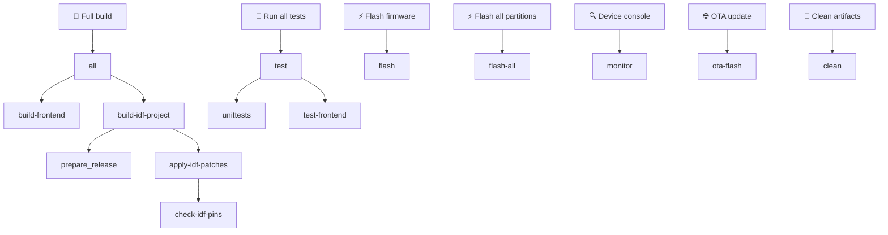
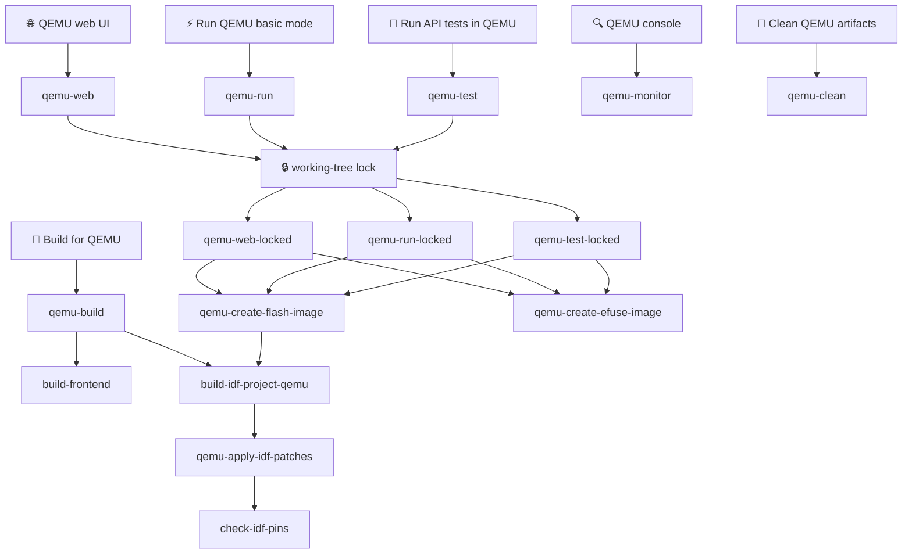

# WB DIY firmware

[Русская версия](README.ru.md)

This repository is a **starting point for building your own Modbus device** on Wiren Board
WB-MGE / WB-MGU hardware. It is not a product firmware you configure and use — it is a
skeleton you compile, flash and then extend with your own logic. Everything a device on a
DIN rail needs is already here and working: a web interface with authentication, OTA
firmware update, Ethernet / Wi-Fi / access-point networking, settings in NVS, LED
indication, a supply-voltage monitor, the config button with a factory reset, a factory
self-test and a QEMU harness that runs the real firmware on a developer machine. What is
deliberately *empty* is the application: two files, one table and one task, which is where
your device actually lives.

The Modbus personality is chosen **once, at build time**:

| `MB_ROLE` | What the device does | Modbus TCP |
| --------- | -------------------- | ---------- |
| `slave` (default) | Answers as a Modbus device on **both** RS-485 ports **and** over Modbus TCP. All three transports share one register table and one address. | yes |
| `master` | Polls other devices on both RS-485 ports through a blocking request API called from your own task. | no |
| `none` | No Modbus at all. The `esp-modbus` component drops out of the image — 82 752 bytes of flash back, versus the slave build. | no |

```bash
make MB_ROLE=slave  build-idf-project   # the default; MB_ROLE may be omitted
make MB_ROLE=master build-idf-project
make MB_ROLE=none   build-idf-project
```

The role is not a runtime setting, and cannot be: `none` exists precisely to keep the
Modbus stack out of the link, which no runtime flag can do. Each role writes its own
generated `sdkconfig`, so switching back and forth cannot leave a stale configuration
behind. See `main/Kconfig.projbuild` for the Kconfig side and the `Modbus role` block in
`Makefile` for the build side.

## Supported hardware

| `TARGET` | Device |
| -------- | ------ |
| `mge_v3` (default) | WB-MGE v.3 |
| `mgu_v1` | WB-MGU v.1 |

Both have two RS-485 ports (`RS485_PORTS_COUNT` in `main/config.h`). The pins live in
`main/boards/<target>.h`, wired in through `main/board_pins.h`; the model string comes from
the `DEVICE_MODEL` branch in `main/config.h`. `TARGET` and `MB_ROLE` are independent and
combine freely:

```bash
make TARGET=mgu_v1 MB_ROLE=master build-idf-project
```

## What answers out of the box

A freshly built **slave** firmware already serves a small demo table, so you can talk to the
device before changing a line. All of it is declared in `mb_reg_table[]` in
`main/mb_slave/mb_registers.c`.

**Input registers** (FC04), refreshed once a second by `mb_refresh_task()` in the same file:

| Address | Name | Meaning |
| ------- | ---- | ------- |
| 0 | `uptime_hi` | Uptime in seconds, high word |
| 1 | `uptime_lo` | Uptime in seconds, low word |
| 2 | `supply_mv` | Supply voltage, millivolts (a fixed 12.3 V under QEMU — `main/qemu/hardware_mocks_qemu.c`) |
| 3 | `free_heap_kib` | Free heap, KiB |

**Holding registers** (FC03 read, FC06 / FC16 write), addresses **0–7**, named `scratch_0`
… `scratch_7`: read-write scratch that starts at 0 and only a master ever changes. They
exist so that a write has somewhere to land while you are wiring up your own logic.

Addresses are 0-based, exactly as they go on the wire. The two spaces are independent —
input register 0 and holding register 0 are different registers. Uptime is spread over two
registers high word first, the order almost every Modbus master defaults to for a 32-bit
big-endian quantity. Only holding and input registers exist; coils and discrete inputs are
not part of the table. A request naming even one address that is not in the table is
refused with ILLEGAL DATA ADDRESS and changes nothing — the all-or-nothing rule Modbus
requires, implemented in the register hook in `main/mb_slave/mb_slave.c`.

The default Modbus address is **1** and the default Modbus TCP port is **502**
(`main/config.h`).

## Extending it

This is the whole point of the repository, so it gets the most space.

### The register table

Every register the device exposes is declared once, in a single static table in
`main/mb_slave/mb_registers.c`:

```c
typedef struct {
    uint16_t      addr;      // Modbus address, 0-based
    mb_reg_kind_t kind;      // MB_REG_INPUT or MB_REG_HOLDING
    bool          writable;  // holding only
    const char   *name;      // for logs
} mb_reg_desc_t;

static const mb_reg_desc_t mb_reg_table[] = {
    // Input registers: device -> master, refreshed once a second by mb_refresh_task().
    {0, MB_REG_INPUT,   false, "uptime_hi"},     // uptime in seconds, high word
    {1, MB_REG_INPUT,   false, "uptime_lo"},     // uptime in seconds, low word
    {2, MB_REG_INPUT,   false, "supply_mv"},     // supply voltage, millivolts
    {3, MB_REG_INPUT,   false, "free_heap_kib"}, // free heap, KiB

    // Holding registers: read-write scratch, default 0.
    {0, MB_REG_HOLDING, true,  "scratch_0"},
    // ...
};
```

**Appending a row is the whole procedure.** The register then answers on every transport the
built role has — in a slave build that is RTU on port 1, RTU on port 2 and Modbus TCP, all
at once. Nothing else needs changing: the value store sizes itself from this table, and the
register hook refuses anything not listed here.

Three rules the rest of the module relies on:

- `(kind, addr)` must be unique. The first match wins, so a duplicate row is dead code.
- `writable` is meaningful for holding registers only. An input register is read-only by
  definition — Modbus has no function code that writes one — so its value reaches the bus
  only through `mb_reg_set()`.
- A holding register with `writable = false` is readable with FC03 and refused with ILLEGAL
  DATA ADDRESS on FC06 / FC16.

### Publishing a value: `mb_reg_set()`

To push a value out to whoever is polling, call `mb_reg_set()` from wherever that value is
produced:

```c
esp_err_t mb_reg_set(mb_reg_kind_t kind, uint16_t addr, uint16_t value);
```

It writes the store and posts nothing — events describe writes that came *from* a master.
`mb_registers.c` contains a worked example: `mb_refresh_task()` is a plain FreeRTOS task, at
a plain priority, deliberately outside the Modbus stack, calling `mb_reg_set()` exactly the
way your own code would.

### Reacting to a write: the event queue, and why there are no callbacks

There are deliberately **no per-register callbacks**. Application logic must never run on
the Modbus stack's task, because that task is what answers the bus inside the RTU
inter-frame timeout — a callback that blocks there turns into a timed-out master, not a slow
function call.

Instead, a write from a master updates the store and posts exactly one event per register on
a FreeRTOS queue (so an FC16 over four registers produces four events). Your logic lives in
`main/mb_slave/user_app.c`, in a task of your own that blocks on that queue. That file is
the example consumer and is meant to be replaced; this is the pattern it demonstrates:

```c
static void user_app_task(void *arg)
{
    QueueHandle_t queue = mb_slave_event_queue();
    if (queue == NULL) {
        ESP_LOGE(TAG, "The Modbus write event queue does not exist, the example task exits");
        vTaskDelete(NULL);
        return;
    }

    while (1) {
        mb_write_event_t event;
        if (xQueueReceive(queue, &event, portMAX_DELAY) != pdTRUE) {
            continue;
        }

        // Replace this line with whatever the write should actually do.
        ESP_LOGI(TAG, "holding %u <- 0x%04X from %s (t=%" PRId64 " us)",
                 event.addr, event.value, src_to_string(event.src), event.timestamp_us);
    }
}
```

Because the stack never calls into application code, whatever you do in that loop — a slow
I2C transaction, an HTTP request, a long computation — cannot delay the answer the device
owes the bus.

Each event carries which transport the write arrived on, the address, the value and a
timestamp:

```c
typedef enum { MB_SRC_RTU_PORT1, MB_SRC_RTU_PORT2, MB_SRC_TCP } mb_event_src_t;

typedef struct {
    mb_event_src_t src;
    uint16_t       addr;
    uint16_t       value;
    int64_t        timestamp_us;
} mb_write_event_t;
```

The event is posted *after* the store is updated, so a consumer woken by it and calling
`mb_reg_get()` straight away reads the value the event describes rather than the one it
replaced. The queue is 32 events deep and is posted to with a zero timeout: a full queue
drops the event rather than blocking the bus, and the drop is logged (rate-limited, with a
running total) so a consumer that fell behind never looks like a master that never wrote.

`main/mb_slave/mb_registers.h` is the whole API surface: `mb_reg_get()`, `mb_reg_set()`,
`mb_reg_find()` and `mb_slave_event_queue()`.

### The master role: a blocking request API

In a `MB_ROLE=master` build there is no register store and no Modbus TCP — a master has
nothing to publish. The entry point is instead three blocking calls, declared in
`main/mb_master/mb_master.h` and meant to be made from an ordinary application task:

```c
esp_err_t mb_master_read_holding(uint8_t port, uint8_t slave_id, uint16_t addr,
                                 uint16_t count, uint16_t *out);
esp_err_t mb_master_read_input(uint8_t port, uint8_t slave_id, uint16_t addr,
                               uint16_t count, uint16_t *out);
esp_err_t mb_master_write_holding(uint8_t port, uint8_t slave_id, uint16_t addr,
                                  uint16_t value);
```

`port` is 0 for RS-485 port 1 and 1 for RS-485 port 2. `addr` is the 0-based register
address, exactly as it goes on the wire. `out` points at `count` native `uint16_t` values —
`esp-modbus` has already swapped each register out of big-endian wire order, so no byte
juggling is needed. Reads are capped at 125 registers, the Modbus limit for one response
frame, and a read addressed to unit id 0 (the broadcast address) is refused rather than
answered from an untouched buffer.

These calls block for as long as the exchange takes — up to the **500 ms response timeout**
when nothing answers — so do not call them from a callback, a timer or anything else that
must return promptly. One mutex per port serialises them, so two tasks may poll the same bus
and will simply queue instead of interleaving two requests on one wire.

Return values worth telling apart:

| Value | Meaning |
| ----- | ------- |
| `ESP_OK` | The device answered and `out` holds its values |
| `ESP_ERR_TIMEOUT` | Nothing answered within the response timeout — the ordinary "not on this bus / switched off" case |
| `ESP_ERR_INVALID_RESPONSE` | Something answered, but not with a usable frame |
| `ESP_ERR_NOT_SUPPORTED` | The device refused the function code |
| `ESP_ERR_INVALID_STATE` | This port is not running (stopped, or its start failed) |
| `ESP_ERR_INVALID_ARG` | Bad port, count or pointer; or, on the two reads, `slave_id` 0 |
| `ESP_FAIL` | The device answered with a Modbus exception |

`main/mb_master/user_app.c` is the example consumer — again meant to be replaced. It polls
three holding registers from unit id 1 on both ports once a second:

```c
for (unsigned port = 0; port < RS485_PORTS_COUNT; port++) {
    uint16_t values[POLL_REG_COUNT] = {0};
    esp_err_t err = mb_master_read_holding((uint8_t)port, POLL_SLAVE_ID,
                                           POLL_REG_ADDR, POLL_REG_COUNT, values);
    if (err == ESP_OK) {
        // Replace this line with whatever the values should actually do.
        ESP_LOGI(TAG, "port %u unit %u holding[%u..%u] = 0x%04X 0x%04X 0x%04X", /* ... */);
    } else if (err == ESP_ERR_TIMEOUT) {
        // The ordinary "nobody answered" case: no device at that unit id on this
        // bus, or it is powered down.
        ESP_LOGW(TAG, "port %u unit %u: no reply (timeout)", /* ... */);
    } else {
        ESP_LOGE(TAG, "port %u unit %u: read failed: %s", /* ... */ esp_err_to_name(err));
    }
}
vTaskDelay(pdMS_TO_TICKS(POLL_PERIOD_MS));
```

Poll loops live or die on telling "silent" apart from "broken", which is why the example
branches on `ESP_ERR_TIMEOUT` rather than on "not `ESP_OK`".

This API sits straight on `mbc_master_send_request()` and deliberately does **not** use the
CID / characteristics-descriptor mechanism `esp-modbus` offers. That mechanism is a polling
table: every value a device might read has to be declared up front before a single request
can be sent. What a DIY user wants is a function call — "read 4 holding registers at 200
from unit 7 on port 1, now, from my own task".

### The `none` role

Neither `main/mb_slave/` nor `main/mb_master/` is compiled, nothing references `esp-modbus`,
and `user_app_start()` is not called at all. Everything else — the web UI, the settings API,
the RS-485 transceiver control, the factory test — keeps working. Use it when the device
you are building talks something that is not Modbus, or nothing at all.

### Where the application starts

`app_main()` in `main/main.c` brings the RS-485 half of the Modbus stack up **before** the
network and the web server, then calls `user_app_start()`. That order is deliberate: a board
sitting on a controller's RS-485 bus with no Ethernet cable and no Wi-Fi must still open its
ports, and in the slave role the event queue must exist before your task blocks on it. The
Modbus TCP listener, which belongs to the slave role and to no other, is started later, once
a network link appears.

## Settings the Modbus side adds

A **slave** build adds exactly two settings, both stored in NVS and both reachable from the
web interface (the *Modbus slave* card on the *Serial ports* page) and from `GET` /
`POST /settings`:

| Key | Meaning | Range | Default |
| --- | ------- | ----- | ------- |
| `mb_slave_id` | The Modbus address this device answers at, on both RS-485 ports and over TCP | 1–247 | 1 |
| `mb_tcp_port` | The TCP port the Modbus TCP server listens on | 1–65535 | 502 |

`mb_slave_id` is capped at 247 because 0 is the broadcast address and 248–255 are reserved
by the Modbus specification (`validate_slave_id()` in `main/setting_validators.c`).

**Both keys exist only in a slave build.** A master addresses each request to a unit id of
its own choosing and runs no TCP server, and the `none` role has neither — so in those roles
the keys are absent from `GET /settings` rather than present and meaningless, and the web
interface does not render the card at all. A `POST` that carries them is accepted and the
keys are ignored, exactly like any other key this firmware does not know, so a successful
write is **not** evidence that the setting was applied. See the `#if WB_MB_ROLE_SLAVE` block
in `main/setting_items.c` and the `mb_slave_id` / `mb_tcp_port` schema comment in
`openapi.yaml`.

Writing either key applies it without a reboot: the Modbus instances are stopped and
restarted with the new values.

The per-port serial parameters (`baudrate_N`, `parity_N`, `stopbits_N`, `databits_N`) and the
transceiver controls (`485_term_N`, `485_fail_safe_N`, `485_tx_dis_N`) are read by both the
slave and the master role from the same keys, and exist in every build.

## Known limitations

- **The master logs every timeout at ERROR level, and there is no knob for it.** The request
  API hands you a clean `ESP_ERR_TIMEOUT`, but `esp-modbus` has already logged the same
  failure itself: `mbc_master_send_request()` ends in `MB_RETURN_ON_FALSE((error == ESP_OK),
  …)`, which expands to `ESP_RETURN_ON_FALSE` and prints `Master send request failure` under
  the tag `MB_CONTROLLER_MASTER`. A poll loop aimed at a device that is not on the bus will
  therefore fill the console with errors that your own code has already handled calmly.
- **A `none` build parks the RS-485 direction pins LOW at boot and leaves the
  transmit-disable switch with nothing to apply it to.** With no UART to drive the DE/RE
  lines, `park_serial_direction_pins()` (`main/update_rs485_mio_gpio_states.c`) drives both
  of them LOW once at boot so each transceiver sits in receive and cannot hold a shared bus —
  a reset pad is an input on a pull-up, and a transceiver that comes up enabled would block
  every other transmitter on the line. The `485_tx_dis_N` settings stay in the API and keep
  their saved values, but in this role there is no "enabled" state for them to select. A
  device reflashed into the slave or master role picks them up again on the next boot.

## Building

### Prerequisites

1. **Node.js 20.x** (version 20.x is required)
2. **Python 3.8+**
3. **Git**

**Note:** these instructions are for Debian/Ubuntu systems.

### 1. Install Node.js 20.x

```bash
curl -fsSL https://deb.nodesource.com/setup_20.x | sudo -E bash -
sudo apt-get install -y nodejs
```

### 2. Install EIM (ESP-IDF Installation Manager)

Debian:

```bash
echo "deb [trusted=yes] https://dl.espressif.com/dl/eim/apt/ stable main" | sudo tee /etc/apt/sources.list.d/espressif.list
sudo apt update
sudo apt install eim-cli
```

RPM-Based Linux:

```bash
sudo tee /etc/yum.repos.d/espressif-eim.repo << 'EOF'
[eim]
name=ESP-IDF Installation Manager
baseurl=https://dl.espressif.com/dl/eim/rpm/$basearch
enabled=1
gpgcheck=0
EOF

sudo dnf install eim-cli
```

macOS:

```bash
brew tap espressif/eim
brew install eim
```

### 3. Install ESP-IDF

```bash
eim install -i v5.4.4
```

The Makefile activates the EIM environment automatically — no manual `source` is needed.

**Note:** the ESP-IDF version is pinned in four places, and they must all agree — plus the IDF actually installed must match them:

| Where | What it pins |
| ----- | ------------ |
| `EIM_IDF_VERSION` in `Makefile` | the version local/EIM builds activate and expect (`v5.4.4`) |
| `FROM espressif/idf:<tag>` in `Dockerfile` | the version CI and container builds use |
| `idf` version range in `main/idf_component.yml` | the versions the component manager accepts (`>=5.4.4,<5.5.0`) |
| `idf` version in `dependencies.lock` | the version the checked-in lock was resolved against (`5.4.4`) |

Two mechanical checks enforce this, and each one has its own escape hatch that disables only itself:

- `make check-idf-pins` compares `EIM_IDF_VERSION` with every `FROM espressif/idf:` tag in `Dockerfile` and with the `idf` version in `dependencies.lock`. It runs automatically before every firmware build (hardware, QEMU, and `make flash`). `IDF_PINS_CHECK=0` skips it, printing a warning.
- `scripts/idf_env.sh` compares the IDF actually in use with `EIM_IDF_VERSION` on every recipe that touches the IDF. `IDF_VERSION_CHECK=0` skips that comparison only — `IDF_PATH` must still point at a real IDF checkout.

The range in `main/idf_component.yml` is not a third check: it is a constraint the component manager evaluates only when it actually re-resolves the dependencies. With `dependencies.lock` committed and the manifest untouched it is never re-evaluated, so it does **not** catch a build on an off-pin IDF. It bites when a re-resolve does happen — no lock, an edited manifest, a changed set of direct dependencies — and then rejects an IDF outside the range with `no versions of idf match`. There is no environment override for it; the range is widened in the file.

**Building against a different ESP-IDF** (e.g. on v5.4.2, to reproduce the `uart_set_pin` regression that v5.4.2/v5.4.3 and v5.5/v5.5.1 carry) therefore takes three steps:

```bash
# 1. Install the version you want to build against
eim install -i v5.4.2

# 2. Widen the range in main/idf_component.yml by hand, e.g.
#      idf:
#        version: '>=5.4.2,<5.5.0'
#    Editing the manifest is itself what forces a dependency re-resolve (its hash
#    changes), and that re-resolve is the only moment the range is checked — so
#    the range must already cover the IDF you are moving to, or the re-resolve
#    you just triggered stops with "no versions of idf match".

# 3. Build with the pin override; IDF_PINS_CHECK=0 waives the cross-check
#    against Dockerfile/dependencies.lock, which still name the pinned version.
make IDF_PINS_CHECK=0 EIM_IDF_VERSION=v5.4.2 build-idf-project
```

Such a build re-resolves the dependencies and rewrites `dependencies.lock`; revert it together with `main/idf_component.yml` when done. Moving the project to a new IDF for good is the same thing done properly: update all four pins (and this README), and no override is needed.

The Modbus stack itself is `espressif/esp-modbus`, pinned to `==2.1.3` in
`main/idf_component.yml`. It supplies framing, CRC, RTU inter-frame timing and the TCP
listener; `main/mb_slave/` and `main/mb_master/` add the wiring, the pins and the register
hook.

### 4. Clone the repository

```bash
git clone git@github.com:wirenboard/wb-mge.git
cd wb-mge
```

### 5. Build

Full build (frontend + firmware), with the default `TARGET=mge_v3` and `MB_ROLE=slave`:

```bash
make
```

Choose a device and a role explicitly:

```bash
make TARGET=mgu_v1 MB_ROLE=master build-idf-project
```

Run all tests (C unit tests + frontend tests):

```bash
make test
```

Build the components separately — frontend first:

```bash
make build-frontend
make build-idf-project
```

> **Note:** `build/` is shared across signatures. When switching `TARGET`, run `make clean`
> first to avoid a stale or mixed artifact. Switching `MB_ROLE` needs no such step: every
> non-default role gets its own generated `sdkconfig`.

`make build-idf-project` finishes by copying the image into `release/` under a name that
carries the target, version, branch and commit.

## Make dependency graph


```mermaid
graph TD
    B["🔨 Full build"] --> all
    T["🧪 Run all tests"] --> test
    F["⚡ Flash firmware"] --> flash
    FA["⚡ Flash all partitions"] --> flash-all
    M["🔍 Device console"] --> monitor
    O["🌐 OTA update"] --> ota-flash
    C["🧹 Clean artifacts"] --> clean

    all --> build-frontend
    all --> build-idf-project
    build-idf-project --> prepare_release
    build-idf-project --> apply-idf-patches
    apply-idf-patches --> check-idf-pins
    test --> unittests
    test --> test-frontend
```


```mermaid
graph TD
    BQ["🔨 Build for QEMU"] --> qemu-build
    W["🌐 QEMU web UI"] --> qemu-web
    T["🧪 Run API tests in QEMU"] --> qemu-test
    R["⚡ Run QEMU basic mode"] --> qemu-run
    MC["🔍 QEMU console"] --> qemu-monitor
    CQ["🧹 Clean QEMU artifacts"] --> qemu-clean

    qemu-build --> build-frontend
    qemu-build --> build-idf-project-qemu

    qemu-web --> L1["🔒 working-tree lock"]
    qemu-run --> L1
    qemu-test --> L1
    L1 --> qemu-web-locked
    L1 --> qemu-run-locked
    L1 --> qemu-test-locked

    qemu-web-locked --> qemu-create-flash-image
    qemu-web-locked --> qemu-create-efuse-image
    qemu-run-locked --> qemu-create-flash-image
    qemu-run-locked --> qemu-create-efuse-image
    qemu-test-locked --> qemu-create-flash-image
    qemu-test-locked --> qemu-create-efuse-image
    qemu-create-flash-image --> build-idf-project-qemu
    build-idf-project-qemu --> qemu-apply-idf-patches
    qemu-apply-idf-patches --> check-idf-pins
```

## Building with Docker

Docker lets you build the project without installing ESP-IDF and Node.js on your host.

### 0. Install Docker

Install Docker according to the [official documentation for your OS](https://docs.docker.com/desktop/setup/install/linux/).

### 1. Build the Docker image

```bash
# From the project root directory
docker build -t wb-mge-builder .
```

This creates an image with ESP-IDF v5.4.4, Node.js 20.x and the build tools.

### 2. Run the container

```bash
docker run --rm -it -v $(pwd):/root/esp/project wb-mge-builder
```

### 3. Build inside the container

Building inside the container is the same as building on the host (see "Building" above).

### Alternative: one-command build

```bash
docker run --rm -v $(pwd):/root/esp/project wb-mge-builder make
```

> **Note:** after `docker run … make`, artifacts in `build/` and `release/` are owned by root.
> Use `sudo make clean` or `sudo rm -rf build release` before any subsequent host build.

## Flashing the device

```bash
make flash
```

`make flash` builds first, so it takes the same `TARGET` and `MB_ROLE` as a build:

```bash
make MB_ROLE=master flash
```

To flash all partitions explicitly (bootloader, partition table, OTA data, app) — useful
when `idf.py flash` cannot detect the port automatically:

```bash
make flash-all
```

`flash-all` pushes the artifacts an earlier build produced, so run the build with the role
you want first.

A device that is already running this firmware can be updated over the network, using the
image in `release/`:

```bash
make ota-flash OTA_HOST=192.168.1.1 OTA_USER=admin OTA_PASS=admin
```

## Connecting to the device console

```bash
make monitor
```

To disconnect from the monitor, press `Ctrl+]`.

## Cleanup

```bash
make clean
```

Or inside the container:

```bash
docker run --rm -v $(pwd):/root/esp/project wb-mge-builder make clean
```

Remove the Docker image:

```bash
docker rmi wb-mge-builder
```

## Running the firmware in QEMU

The whole firmware — web UI, settings, OTA, Modbus TCP — runs in the ESP32 emulator on a
developer machine, with no hardware attached. `README_QEMU.md` is the full guide; the short
version:

```bash
make qemu-web     # build, then run QEMU with the web UI forwarded to the host
make qemu-test    # build, then run the api_tests/ pytest suite against it
make qemu-monitor # attach a console to an already-running instance
```

`MB_ROLE` works here exactly as it does for a hardware build, and the QEMU build keeps a
separate generated `sdkconfig` per role:

```bash
make MB_ROLE=none qemu-test
```

**Host ports follow a slot.** Every host port (web UI, Modbus TCP, UART chardevs, the IO
bus) is derived from `WB_MGE_PORT_SLOT` by `api_tests/qemu_ports.py`, so several checkouts
can run QEMU on one machine without colliding. Slot 0, the default, puts the web UI on
`http://localhost:21000` (login `admin` / `admin`) and the Modbus TCP server on `21002`.
Do not trust those numbers — print the block your environment resolves to:

```bash
make qemu-ports
```

**One run per working tree.** The slot separates ports only; `build/qemu_flash.bin` and the
other run artifacts are per-tree, so a second run in the same checkout is refused by an
exclusive lock on `.e2e-tree.lock`. To run two suites at once, use two checkouts (or
`git worktree`), each with its own slot.

Filter the test suite by name:

```bash
make qemu-test PYTEST_ARGS="-k test_auth"
```

If a previous run left a stale process behind:

```bash
pkill -9 -f qemu-system-xtensa
```

## Test infrastructure setup from scratch (Debian 13)

Steps to provision a clean Debian 13 (trixie) host to build the QEMU firmware and run the
`api_tests/` suite end-to-end. Performed as `root`.

### 1. OS packages

```bash
apt-get update
apt-get install -y --no-install-recommends \
    ca-certificates curl gnupg lsb-release \
    git make cmake ninja-build \
    python3 python3-pip python3-venv \
    libusb-1.0-0 libssl-dev libffi-dev \
    libsdl2-2.0-0 libpixman-1-0 libslirp0 libglib2.0-0 \
    file flex bison gperf wget xz-utils dfu-util
```

### 2. Node.js 20.x

```bash
curl -fsSL https://deb.nodesource.com/setup_20.x | bash -
apt-get install -y nodejs
```

### 3. ESP-IDF v5.4.4 via EIM

Add the official EIM apt repository and install `eim-cli`:

```bash
echo "deb [trusted=yes] https://dl.espressif.com/dl/eim/apt/ stable main" \
    > /etc/apt/sources.list.d/espressif.list
apt-get update
apt-get install -y eim-cli
```

Install ESP-IDF (uses `/var/tmp/eim-work` as scratch space to avoid filling `/tmp`):

```bash
mkdir -p /var/tmp/eim-work
TMPDIR=/var/tmp/eim-work eim install --idf-versions v5.4.4 --target esp32 --non-interactive true -v
```

After install, ESP-IDF lives in `/root/.espressif/v5.4.4/esp-idf` and is activated with:

```bash
source /root/.espressif/tools/activate_idf_v5.4.4.sh
```

### 4. QEMU xtensa

EIM does not install QEMU. Use `idf_tools.py` from the activated environment:

```bash
source /root/.espressif/tools/activate_idf_v5.4.4.sh
python "$IDF_PATH/tools/idf_tools.py" install qemu-xtensa
```

This places the binary at `/root/.espressif/tools/tools/qemu-xtensa/esp_develop_*/qemu/bin/qemu-system-xtensa`, which the `make qemu-*` targets discover automatically.

### 5. Clone the repository

```bash
cd /root
git clone https://github.com/wirenboard/wb-mge.git
cd wb-mge
```

### 6. Python virtualenv for `api_tests/`

```bash
python3 -m venv api_tests/.venv
api_tests/.venv/bin/pip install -r api_tests/requirements.txt
```

The `make qemu-test` target selects the Python interpreter via `PYTEST_PYTHON`: it prefers
`api_tests/.venv/bin/python` (developer workflow) and falls back to `/opt/api_tests_venv/bin/python`
(CI/Docker image, where the venv is pre-baked). Override with `make qemu-test PYTEST_PYTHON=/path/to/python` if needed.

### 7. Build firmware + frontend and run the tests

```bash
cd /root/wb-mge
make qemu-build
make qemu-test
```

### Notes

- The initial run downloads ~2 GB of toolchains/components (EIM + xtensa toolchain + IDF managed components); expect ~10 minutes on a fresh host.
- ESP-IDF tools occupy ~5 GB under `/root/.espressif`. Allocate at least 15 GB of free disk before starting.
- `make qemu-create-flash-image` depends on `build-idf-project-qemu` and compiles the QEMU firmware (incremental) before merging images. If `build/` contains a hardware build, it automatically runs `fullclean` and rebuilds for QEMU.

## Permanently disabling Wi-Fi

The firmware supports a one-way permanent Wi-Fi disable mode. When activated, the Wi-Fi
hardware driver is never initialised — the radio stays off across all boots. The Wi-Fi
settings section is hidden in the web interface. This mode cannot be reversed via the API.

**Activate via the API (requires a reboot to take effect):**

```bash
# Authenticate first
curl -s -c cookies.txt -X POST http://192.168.0.7/auth \
  -H 'Content-Type: application/json' \
  -d '{"login":"admin","pass":"admin"}'

# Permanently disable Wi-Fi
curl -s -b cookies.txt -X POST http://192.168.0.7/settings \
  -H 'Content-Type: application/json' \
  -d '{"wifi_perm_disable": true}'

# Reboot to apply
curl -s -b cookies.txt -X POST http://192.168.0.7/cmd \
  -H 'Content-Type: application/json' \
  -d '{"cmd": "reboot"}'
```

After the reboot, `GET /settings` no longer includes a `wifi` group and returns
`"wifi_perm_disable": true`. Sending `{"wifi_perm_disable": false}` is silently ignored.

> **Warning:** this operation is irreversible via the API. To restore Wi-Fi, perform a
> factory reset via the Config button (hold 5 seconds) or flash the device again.

## Where to look in the source

| Path | What is there |
| ---- | ------------- |
| `main/mb_slave/mb_registers.c` | **The register table — the first file to edit** |
| `main/mb_slave/user_app.c` | **Your logic in the slave role — meant to be replaced** |
| `main/mb_master/user_app.c` | **Your logic in the master role — meant to be replaced** |
| `main/mb_slave/mb_registers.h` | `mb_reg_get()` / `mb_reg_set()` / the event queue |
| `main/mb_master/mb_master.h` | The blocking request API and its error contract |
| `main/mb_slave/mb_slave.c` | The three Modbus instances and the register hook |
| `main/mb_master/mb_master.c` | The two RTU master instances |
| `main/mb_role.h` | The build-time role, as three compile-time constants |
| `main/Kconfig.projbuild` | The Kconfig choice behind `MB_ROLE` |
| `main/main.c` | `app_main()` — boot order, and where `user_app_start()` is called |
| `main/setting_items.c` | Every setting, its default and its validator |
| `openapi.yaml` | The HTTP API |
| `README_QEMU.md` | The emulator, the IO state bus and the coverage targets |
| `api_tests/` | The end-to-end suite that drives the firmware under QEMU |
| `unittests/` | Host unit tests |

## Licence

The WB License (MIT-WB) — see [LICENSE.md](LICENSE.md).
