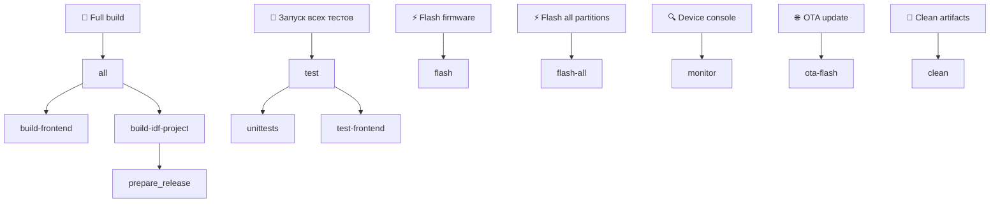
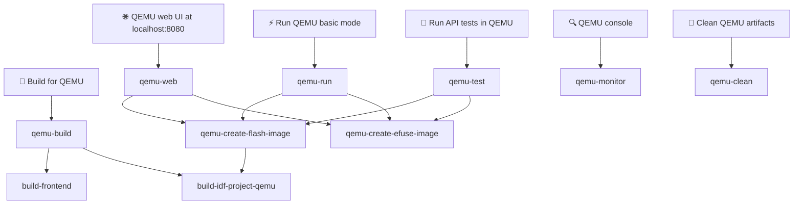

# WB-MGE
Мультипротокольный шлюз Wiren Board

[English README](README.md)

## Описание проекта

WB-MGE предназначен для подключения устройств с интерфейсом RS-485 и боковых модулей
ввода-вывода WBIO к серверу автоматизации через Ethernet или Wi-Fi.

Все функции, описанные ниже, настраиваются и контролируются через встроенный веб-интерфейс:


Для каждого из портов доступно два режима:

 - **Modbus TCP** — только для Modbus-устройств: полноценный конвертер **Modbus TCP ↔ Modbus RTU**.
   Для сети шлюз выступает Modbus TCP-сервером, а на шине RS-485 — Modbus RTU-мастером: снимает
   MBAP-заголовок из TCP-запроса, формирует RTU-кадр (добавляет CRC), опрашивает устройство и
   упаковывает RTU-ответ обратно в Modbus TCP.
 - **Прозрачный шлюз** — подходит для любых протоколов, работающих поверх RS-485; байты
   пересылаются «как есть», без разбора кадров. Может работать как TCP-**сервер** (ожидает
   входящие подключения) или TCP-**клиент** (сам подключается к удалённому TCP-узлу `ip:port`).

   

   *Каждый порт независимо переключается между режимами **Modbus TCP** и **Прозрачный мост**
   (сервер/клиент) на странице TCP-шлюза.*

Дополнительно поверх любого режима для каждого порта можно включить:

 - **Кэш (Cache TCP)** — пассивно отслеживает Modbus-обмен на шине, сохраняет последние
   значения регистров и битов и отдаёт их по отдельному Modbus TCP-серверу без повторного
   опроса устройств (ответ «из кэша»). Доступен также через `GET /cache/json` и `/cache/csv`.

   

   *Страница **«Карта регистров»** показывает кэш, автоматически собранный из трафика шины,
   настройку тайм-аута значений и сброс, экспорт CSV/JSON, а также Modbus TCP-сервер (порт 504),
   отвечающий прямо из кэша.*

 - **Сниффер** — захватывает трафик RS-485 в обе стороны, декодирует Modbus-кадры и
   транслирует их в веб-интерфейс по WebSocket для диагностики.

   

   *Нажмите **Start**, чтобы в реальном времени получать декодированные кадры (фильтрация по
   Slave ID / коду функции, щелчок по строке расшифровывает кадр); инструмент **Send packet**
   формирует и отправляет в шину запросы на чтение (FC01–FC04) и запись (FC05/06/15/16) с
   автоматически вычисленным CRC и предпросмотром кадра.*

Отдельно оба порта вместе могут работать как:

 - **Повторитель** — прозрачная передача «последовательный↔последовательный», которая связывает
   два порта RS-485 напрямую друг с другом, а не с сетью: байты, принятые на Порту 1,
   пересылаются на Порт 2 и наоборот, «как есть», без разбора кадров. Используется для удлинения
   линии RS-485 и восстановления целостности сигнала. Режим активируется только когда **оба**
   порта переведены в режим повторителя; на странице *Повторитель* веб-интерфейса отображается
   статистика пересылки в реальном времени — переслано байт в каждую сторону, потеряно байт по
   каждому порту, время работы и средняя скорость (сырые счётчики также доступны в объекте
   `repeater` ответа `GET /info`). **Внимание:** пока повторитель активен, оба сегмента ведут
   себя как электрически соединённые — если мастер присутствует с обеих сторон, шины столкнутся
   и связь нарушится.

   

   *Страница «Повторитель» показывает переключатель включения и статистику пересылки в реальном
   времени; режим активируется только когда оба порта переведены в режим повторителя.*

## Карта регистров устройства (Unit ID 255)

Сам шлюз отвечает на Modbus-опрос по своему адресу **Unit ID 255 (0xFF)** — согласно
Modbus Messaging Implementation Guide этот адрес зарезервирован за самим TCP-шлюзом.
Работает в режимах **Modbus TCP** и **Cache TCP**, независимо от состояния кэша
(в режиме Modbus TCP такой запрос не пересылается в RS-485). Поддерживаются функции
чтения **FC04** (input) и **FC03** (holding).

### Input-регистры (FC04, read-only)

| Адрес (dec) | Адрес (hex)   | Регистров | Тип    | Описание                                                                    |
|-------------|---------------|-----------|--------|-----------------------------------------------------------------------------|
| 104–105     | 0x0068–0x0069 | 2         | u32    | Время работы с момента загрузки, секунды                                    |
| 121         | 0x0079        | 1         | u16    | Текущее напряжение питания, мВ                                              |
| 200–219     | 0x00C8–0x00DB | 20        | string | Модель устройства                                                           |
| 220–244     | 0x00DC–0x00F4 | 25        | string | Хэш коммита и ветка, откуда собрана прошивка                                |
| 250–265     | 0x00FA–0x0109 | 16        | string | Версия прошивки (строкой)                                                   |
| 266–267     | 0x010A–0x010B | 2         | u32    | Схема генерации серийного номера (4 — получен из 48-битного MAC)             |
| 268–271     | 0x010C–0x010F | 4         | u64    | Серийный номер, MSW-first (48-битный MAC в младших битах)                    |
| 320         | 0x0140        | 1         | u16    | Версия прошивки: MAJOR                                                      |
| 321         | 0x0141        | 1         | u16    | Версия прошивки: MINOR                                                      |
| 322         | 0x0142        | 1         | u16    | Версия прошивки: PATCH                                                      |
| 323         | 0x0143        | 1         | s16    | Версия прошивки: SUFFIX (+N для `+wbN`, −N для `-rcN`, 0 если нет)          |
| 324–325     | 0x0144–0x0145 | 2         | u32    | Версия в числовом формате (порядок слов little-endian: 324 — младшее слово) |
| 326–327     | 0x0146–0x0147 | 2         | u32    | Версия в числовом формате (порядок слов big-endian: 326 — старшее слово)    |
| 528–529     | 0x0210–0x0211 | 2         | u32    | Количество обработанных пакетов (с последнего сброса кэша)                  |
| 530–531     | 0x0212–0x0213 | 2         | u32    | Секунд с момента последнего пакета на шине                                  |
| 532         | 0x0214        | 1         | u16    | Количество устройств на шине (уникальных slave_id в кэше)                   |
| 533         | 0x0215        | 1         | u16    | Средняя частота опроса шины, опросов/мин                                    |
| 534         | 0x0216        | 1         | u16    | Таймаут значения кэша, секунды                                              |
| 65504       | 0xFFE0        | 1         | u16    | Максимальный использованный стек, КБ (0 — стек повреждён / неизвестно)      |
| 65505       | 0xFFE1        | 1         | u16    | Объём свободной оперативной памяти, КБ                                      |
| 65506       | 0xFFE2        | 1         | u16    | Объём используемой оперативной памяти, КБ                                   |
| 65507       | 0xFFE3        | 1         | u16    | Размер стека, КБ                                                            |
| 65508       | 0xFFE4        | 1         | u16    | Причина последней перезагрузки МК                                           |

### Holding-регистры (FC03, read-only)

| Адрес (dec) | Адрес (hex)   | Регистров | Тип    | Описание           |
|-------------|---------------|-----------|--------|--------------------|
| 290–301     | 0x0122–0x012D | 12        | string | Сигнатура прошивки |

### Примечания к карте регистров

- **FC03 и FC04 используют общее адресное пространство**: каждый адрес из обеих таблиц
  отвечает по обеим функциям одним и тем же значением. Разделение выше лишь показывает, куда
  поле отнесено в общей карте регистров Wiren Board.
- **Строки (модель, версия прошивки, сигнатура)**: упаковка MEM_8 — 1 символ на регистр в
  младшем байте, старший байт = 0x00; хвост дополняется нулями.
- **Git-инфо**: 2 символа на регистр, первый символ в младшем байте; хвост дополняется нулями.
- **Многорегистровые целые** (кроме 324–325) хранятся в порядке слов big-endian — старшее
  слово в младшем адресе.
- **Числовая версия** считается по правилу Wiren Board
  ([wiki](https://wiki.wirenboard.com/wiki/Modbus-hardware-version)):
  `if (SUFFIX >= 0) enc = SUFFIX + 128; else enc = -1 - SUFFIX;`
  `VERSION = (MAJOR << 24) | (MINOR << 16) | (PATCH << 8) | enc`.
- **Причина перезагрузки** (65508): 1 — LPWR (brownout/выход из сна), 2 — WWDG (interrupt
  watchdog), 3 — IWDG (task/общий watchdog), 4 — SFT (программный сброс/паника), 5 — POR
  (включение питания), 6 — PIN (внешний сброс), 0 — неизвестно. Маппинг с `esp_reset_reason()`.
- **Статистика шины** (528–534) берётся из мультимастер-кэша; при неактивном кэше
  соответствующие поля читаются как 0. Блок вынесен на 528, чтобы не пересекаться с общей картой
  регистров Wiren Board — в первую очередь с полем версии загрузчика: это **8 holding-регистров
  с адреса 330** (330–337, `modbus_client -t0x03 -r330 -c8`), они здесь не определены.
- Чтение диапазона, где хотя бы один адрес не определён, возвращает исключение **0x02**
  (illegal data address); функция, отличная от FC03/FC04, — исключение **0x01**
  (illegal function).

## Ручные UI-тесты

Сценарии ручной проверки веб-интерфейса. В каждом документе — пошаговая процедура с
ожидаемыми результатами.

- [docs/ui_smoke_test.md](docs/ui_smoke_test.md) — высокоуровневый визуальный
  smoke-тест всего веб-интерфейса: все пункты меню открываются, реагируют кнопки,
  формы принимают ввод, корректно работает мобильное разрешение.

## Инструкции по ручной сборке

### Необходимые инструменты

1. **Node.js 20.x** (требуется версия 20.x)
2. **Python 3.8+** (требуется версия 3.8 или выше)
3. **Git**

**Note:** Приведенные ниже инструкции предназначены для Debian/Ubuntu систем

### 1. Установка Node.js 20.x

```bash
curl -fsSL https://deb.nodesource.com/setup_20.x | sudo -E bash -
sudo apt-get install -y nodejs
```

### 2. Установка EIM (ESP-IDF Installation Manager)

Debian:
```bash
echo "deb [trusted=yes] https://dl.espressif.com/dl/eim/apt/ stable main" | sudo tee /etc/apt/sources.list.d/espressif.list
sudo apt update
sudo apt install eim-cli
```

RPM-Based Linux:
```bash
sudo tee /etc/yum.repos.d/espressif-eim.repo << 'EOF'
[eim]
name=ESP-IDF Installation Manager
baseurl=https://dl.espressif.com/dl/eim/rpm/$basearch
enabled=1
gpgcheck=0
EOF

sudo dnf install eim-cli
```

macOS:
```bash
brew tap espressif/eim
brew install eim
```


### 3. Установка ESP-IDF


```bash
eim install -i v5.4
```

Makefile активирует окружение EIM автоматически — `source` перед `make` не нужен.

### 4. Клонирование репозитория

```bash
git clone git@github.com:wirenboard/wb-mge.git
cd wb-mge
```

### 5. Сборка проекта

Для полной сборки проекта (frontend + прошивка):

```bash
make
```

Чтобы запустить все тесты (C юниттесты + тесты фронтенда):

```bash
make test
```

Если компоненты собираются отдельно, то сначала соберите frontend:

```bash
make build-frontend
```

Затем прошивку:

```bash
make build-idf-project
```

## Make Dependency Graph





## Сборка с использованием Docker

Docker позволяет собирать проект без установки ESP-IDF и Node.js на хост-систему.

### 0. Установка Docker

Установите Docker согласно официальной документации для вашей ОС:
https://docs.docker.com/desktop/setup/install/linux/

### 1. Сборка Docker образа

```bash
# Из корневой директории проекта
docker build -t wb-mge-builder .
```

Это создаст Docker образ с:
- ESP-IDF v5.4
- Node.js 20.x
- Всеми необходимыми инструментами для сборки

### 2. Запуск контейнера

```bash
docker run --rm -it -v $(pwd):/root/esp/project wb-mge-builder
```

### 3. Сборка внутри контейнера

Сборка внутри контейнера не отличается от обычной сборки (см. раздел "Инструкции по ручной сборке", пункт 5).

### Альтернатива: сборка одной командой

Можно собрать проект, не заходя в контейнер:

```bash
docker run --rm -v $(pwd):/root/esp/project wb-mge-builder make
```


## Прошивка устройства

```bash
make flash
```

Для прошивки всех разделов явно (загрузчик, таблица разделов, OTA-данные, приложение):

```bash
make flash-all
```

## Подключение к консоли устройства

```bash
make monitor
```

Для отключения от монитора нажмите `Ctrl+]`.

## Очистка

```bash
make clean
```

Или внутри контейнера:

```bash
docker run --rm -v $(pwd):/root/esp/project wb-mge-builder make clean
```

Удалить Docker образ:
```bash
docker rmi wb-mge-builder
```

## Настройка тестовой инфраструктуры с нуля (Debian 13)

Шаги для подготовки чистого хоста Debian 13 (trixie) для сборки прошивки QEMU и запуска набора тестов `api_tests/` от начала до конца. Выполняется от имени `root`.

### 1. Системные пакеты

```bash
apt-get update
apt-get install -y --no-install-recommends \
    ca-certificates curl gnupg lsb-release \
    git make cmake ninja-build \
    python3 python3-pip python3-venv \
    libusb-1.0-0 libssl-dev libffi-dev \
    libsdl2-2.0-0 libpixman-1-0 libslirp0 libglib2.0-0 \
    file flex bison gperf wget xz-utils dfu-util
```

### 2. Node.js 20.x

```bash
curl -fsSL https://deb.nodesource.com/setup_20.x | bash -
apt-get install -y nodejs
```

### 3. ESP-IDF v5.4 via EIM (Espressif Installation Manager)

Добавьте официальный apt-репозиторий EIM и установите `eim-cli`:

```bash
echo "deb [trusted=yes] https://dl.espressif.com/dl/eim/apt/ stable main" \
    > /etc/apt/sources.list.d/espressif.list
apt-get update
apt-get install -y eim-cli
```

Установите ESP-IDF (использует `/var/tmp/eim-work` как временную директорию, чтобы не переполнить `/tmp`):

```bash
mkdir -p /var/tmp/eim-work
TMPDIR=/var/tmp/eim-work eim install --idf-versions v5.4 --target esp32 --non-interactive true -v
```

После установки ESP-IDF находится в `/root/.espressif/v5.4/esp-idf` и активируется командой:

```bash
source /root/.espressif/tools/activate_idf_v5.4.sh
```

### 4. QEMU xtensa

EIM не устанавливает QEMU. Используйте `idf_tools.py` из активированного окружения:

```bash
source /root/.espressif/tools/activate_idf_v5.4.sh
python "$IDF_PATH/tools/idf_tools.py" install qemu-xtensa
```

Бинарный файл будет размещён по пути `/root/.espressif/tools/tools/qemu-xtensa/esp_develop_*/qemu/bin/qemu-system-xtensa` — цели `make qemu-*` обнаруживают его автоматически.

### 5. Клонирование репозитория

```bash
cd /root
git clone https://github.com/wirenboard/wb-mge.git
cd wb-mge
```

### 6. Python virtualenv для `api_tests/`

```bash
python3 -m venv api_tests/.venv
api_tests/.venv/bin/pip install -r api_tests/requirements.txt
```

Цель `make qemu-test` выбирает интерпретатор Python через переменную `PYTEST_PYTHON`: предпочитает
`api_tests/.venv/bin/python` (workflow разработчика), при его отсутствии использует
`/opt/api_tests_venv/bin/python` (CI/Docker-образ, где venv запечён заранее). Для явного выбора:
`make qemu-test PYTEST_PYTHON=/path/to/python`.

### 7. Сборка прошивки + frontend и запуск тестов

Соберите всё для QEMU (frontend + прошивка с конфигурацией QEMU):

```bash
cd /root/wb-mge
make qemu-build
```

Сгенерируйте образы flash и eFuse:

```bash
make qemu-create-flash-image
make qemu-create-efuse-image
```

Запустите набор API-тестов (загружает QEMU, запускает pytest, завершает QEMU):

```bash
make qemu-test
```

Запуск тестов по имени:

```bash
make qemu-test PYTEST_ARGS="-k test_auth"
```

Запуск QEMU с веб-интерфейсом на http://localhost:8080:

```bash
make qemu-web
```

Если предыдущий запуск QEMU оставил зависший процесс, завершите его перед повторным запуском:

```bash
pkill -9 -f qemu-system-xtensa
```

### Примечания

- Первый запуск загружает ~2 ГБ тулчейнов и компонентов (EIM + xtensa toolchain + managed components IDF); на чистом хосте ожидайте около ~10 минут.
- Инструменты ESP-IDF занимают ~5 ГБ в `/root/.espressif`. Перед началом выделите не менее 15 ГБ свободного места на диске.
- `make qemu-create-flash-image` зависит от `build-idf-project-qemu` и перед объединением образов компилирует прошивку QEMU (инкрементально). Если в `build/` находится аппаратная сборка, автоматически выполняется `fullclean` и пересборка для QEMU.

## Постоянное отключение Wi-Fi

WB-MGE поддерживает однонаправленный режим постоянного отключения Wi-Fi. При активации драйвер Wi-Fi никогда не инициализируется — радиомодуль остаётся выключенным при всех последующих загрузках. Раздел настроек Wi-Fi скрывается в веб-интерфейсе. Отменить этот режим через API невозможно.

**Активация через API (требует перезагрузки для вступления в силу):**

```bash
# Сначала авторизуемся
curl -s -c cookies.txt -X POST http://192.168.0.7/auth \
  -H 'Content-Type: application/json' \
  -d '{"login":"admin","pass":"admin"}'

# Постоянно отключаем Wi-Fi
curl -s -b cookies.txt -X POST http://192.168.0.7/settings \
  -H 'Content-Type: application/json' \
  -d '{"wifi_perm_disable": true}'

# Перезагружаемся для применения изменений
curl -s -b cookies.txt -X POST http://192.168.0.7/cmd \
  -H 'Content-Type: application/json' \
  -d '{"cmd": "reboot"}'
```

После перезагрузки `GET /settings` не возвращает группу `wifi` и содержит `"wifi_perm_disable": true`.
Отправка `{"wifi_perm_disable": false}` молча игнорируется.

> **Внимание:** Эта операция необратима через API. Для восстановления Wi-Fi выполните сброс к заводским настройкам через кнопку Config (удерживать 5 секунд) или перепрошейте устройство.
