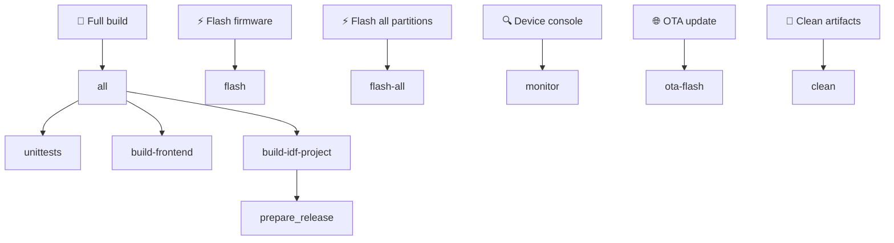
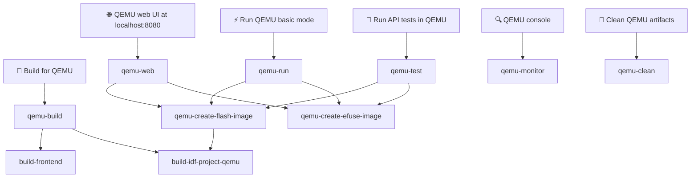

# WB-MGE
Мультипротокольный шлюз Wiren Board

[English README](README.md)

## Описание проекта

WB-MGE предназначен для подключения устройств с интерфейсом RS-485 и боковых модулей
ввода-вывода WBIO к серверу автоматизации через Ethernet или Wi-Fi.

Для каждого из портов доступно два режима:

 - Modbus TCP — только для Modbus-устройств
 - Прозрачный шлюз — подходит для любых протоколов, работающих поверх RS-485.

## Инструкции по ручной сборке

### Необходимые инструменты

1. **Node.js 20.x** (требуется версия 20.x)
2. **Python 3.8+** (требуется версия 3.8 или выше)
3. **Git**

**Note:** Приведенные ниже инструкции предназначены для Debian/Ubuntu систем

### 1. Установка Node.js 20.x

```bash
curl -fsSL https://deb.nodesource.com/setup_20.x | sudo -E bash -
sudo apt-get install -y nodejs
```

### 2. Установка EIM (ESP-IDF Installation Manager)

Debian:
```bash
echo "deb [trusted=yes] https://dl.espressif.com/dl/eim/apt/ stable main" | sudo tee /etc/apt/sources.list.d/espressif.list
sudo apt update
sudo apt install eim-cli
```

RPM-Based Linux:
```bash
sudo tee /etc/yum.repos.d/espressif-eim.repo << 'EOF'
[eim]
name=ESP-IDF Installation Manager
baseurl=https://dl.espressif.com/dl/eim/rpm/$basearch
enabled=1
gpgcheck=0
EOF

sudo dnf install eim-cli
```

macOS:
```bash
brew tap espressif/eim
brew install eim
```


### 3. Установка ESP-IDF


```bash
eim install -i v5.4
```

Makefile активирует окружение EIM автоматически — `source` перед `make` не нужен.

### 4. Клонирование репозитория

```bash
git clone git@github.com:wirenboard/wb-mge.git
cd wb-mge
```

### 5. Сборка проекта

Для полной сборки проекта (юниттесты + frontend + прошивка):

```bash
make
```

Если компоненты собираются отдельно, то сначала соберите frontend:

```bash
make build-frontend
```

Затем прошивку:

```bash
make build-idf-project
```

## Make Dependency Graph





## Сборка с использованием Docker

Docker позволяет собирать проект без установки ESP-IDF и Node.js на хост-систему.

### 0. Установка Docker

Установите Docker согласно официальной документации для вашей ОС:
https://docs.docker.com/desktop/setup/install/linux/

### 1. Сборка Docker образа

```bash
# Из корневой директории проекта
docker build -t wb-mge-builder .
```

Это создаст Docker образ с:
- ESP-IDF v5.4
- Node.js 20.x
- Всеми необходимыми инструментами для сборки

### 2. Запуск контейнера

```bash
docker run --rm -it -v $(pwd):/root/esp/project wb-mge-builder
```

### 3. Сборка внутри контейнера

Сборка внутри контейнера не отличается от обычной сборки (см. раздел "Инструкции по ручной сборке", пункт 5).

### Альтернатива: сборка одной командой

Можно собрать проект, не заходя в контейнер:

```bash
docker run --rm -v $(pwd):/root/esp/project wb-mge-builder make
```


## Прошивка устройства

```bash
make flash
```

Для прошивки всех разделов явно (загрузчик, таблица разделов, OTA-данные, приложение):

```bash
make flash-all
```

## Подключение к консоли устройства

```bash
make monitor
```

Для отключения от монитора нажмите `Ctrl+]`.

## Очистка

```bash
make clean
```

Или внутри контейнера:

```bash
docker run --rm -v $(pwd):/root/esp/project wb-mge-builder make clean
```

Удалить Docker образ:
```bash
docker rmi wb-mge-builder
```

## Настройка тестовой инфраструктуры с нуля (Debian 13)

Шаги для подготовки чистого хоста Debian 13 (trixie) для сборки прошивки QEMU и запуска набора тестов `api_tests/` от начала до конца. Выполняется от имени `root`.

### 1. Системные пакеты

```bash
apt-get update
apt-get install -y --no-install-recommends \
    ca-certificates curl gnupg lsb-release \
    git make cmake ninja-build \
    python3 python3-pip python3-venv \
    libusb-1.0-0 libssl-dev libffi-dev \
    libsdl2-2.0-0 libpixman-1-0 libslirp0 libglib2.0-0 \
    file flex bison gperf wget xz-utils dfu-util
```

### 2. Node.js 20.x

```bash
curl -fsSL https://deb.nodesource.com/setup_20.x | bash -
apt-get install -y nodejs
```

### 3. ESP-IDF v5.4 via EIM (Espressif Installation Manager)

Добавьте официальный apt-репозиторий EIM и установите `eim-cli`:

```bash
echo "deb [trusted=yes] https://dl.espressif.com/dl/eim/apt/ stable main" \
    > /etc/apt/sources.list.d/espressif.list
apt-get update
apt-get install -y eim-cli
```

Установите ESP-IDF (использует `/var/tmp/eim-work` как временную директорию, чтобы не переполнить `/tmp`):

```bash
mkdir -p /var/tmp/eim-work
TMPDIR=/var/tmp/eim-work eim install --idf-versions v5.4 --target esp32 --non-interactive true -v
```

После установки ESP-IDF находится в `/root/.espressif/v5.4/esp-idf` и активируется командой:

```bash
source /root/.espressif/tools/activate_idf_v5.4.sh
```

### 4. QEMU xtensa

EIM не устанавливает QEMU. Используйте `idf_tools.py` из активированного окружения:

```bash
source /root/.espressif/tools/activate_idf_v5.4.sh
python "$IDF_PATH/tools/idf_tools.py" install qemu-xtensa
```

Бинарный файл будет размещён по пути `/root/.espressif/tools/tools/qemu-xtensa/esp_develop_*/qemu/bin/qemu-system-xtensa` — цели `make qemu-*` обнаруживают его автоматически.

### 5. Клонирование репозитория

```bash
cd /root
git clone https://github.com/wirenboard/wb-mge.git
cd wb-mge
```

### 6. Python virtualenv для `api_tests/`

```bash
python3 -m venv api_tests/.venv
api_tests/.venv/bin/pip install -r api_tests/requirements.txt
```

Цель `make qemu-test` вызывает `api_tests/.venv/bin/python` напрямую, поэтому виртуальное окружение должно находиться в `api_tests/.venv`.

### 7. Сборка прошивки + frontend и запуск тестов

Соберите всё для QEMU (frontend + прошивка с конфигурацией QEMU):

```bash
cd /root/wb-mge
make qemu-build
```

Сгенерируйте образы flash и eFuse:

```bash
make qemu-create-flash-image
make qemu-create-efuse-image
```

Запустите набор API-тестов (загружает QEMU, запускает pytest, завершает QEMU):

```bash
make qemu-test
```

Запуск тестов по имени:

```bash
make qemu-test PYTEST_ARGS="-k test_auth"
```

Запуск QEMU с веб-интерфейсом на http://localhost:8080:

```bash
make qemu-web
```

Если предыдущий запуск QEMU оставил зависший процесс, завершите его перед повторным запуском:

```bash
pkill -9 -f qemu-system-xtensa
```

### Примечания

- Первый запуск загружает ~2 ГБ тулчейнов и компонентов (EIM + xtensa toolchain + managed components IDF); на чистом хосте ожидайте около ~10 минут.
- Инструменты ESP-IDF занимают ~5 ГБ в `/root/.espressif`. Перед началом выделите не менее 15 ГБ свободного места на диске.
- `make qemu-create-flash-image` зависит от `build-idf-project-qemu` и перед объединением образов компилирует прошивку QEMU (инкрементально). Если в `build/` находится аппаратная сборка, автоматически выполняется `fullclean` и пересборка для QEMU.
