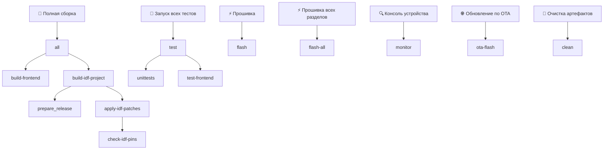
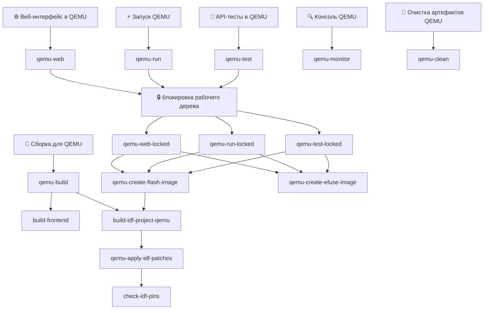

# Прошивка WB DIY

[English README](README.md)

Этот репозиторий — **заготовка для сборки собственного Modbus-устройства** на железе
Wiren Board WB-MGE / WB-MGU. Это не готовая прошивка продукта, которую настраивают и
эксплуатируют, а скелет: его собирают, прошивают и дальше дополняют своей логикой. Всё, что
нужно устройству на DIN-рейке, здесь уже есть и работает: веб-интерфейс с аутентификацией,
обновление прошивки по OTA, сеть через Ethernet / Wi-Fi / точку доступа, настройки в NVS,
светодиодная индикация, монитор напряжения питания, кнопка Config со сбросом к заводским
настройкам, заводской самотест и QEMU-стенд, который гоняет настоящую прошивку на машине
разработчика. Намеренно *пустым* оставлено только приложение: два файла, одна таблица и одна
задача — там и живёт ваше устройство.

Роль в Modbus выбирается **один раз, на этапе сборки**:

| `MB_ROLE` | Что делает устройство | Modbus TCP |
| --------- | --------------------- | ---------- |
| `slave` (по умолчанию) | Отвечает как Modbus-устройство на **обоих** портах RS-485 **и** по Modbus TCP. Все три транспорта используют общую таблицу регистров и общий адрес. | да |
| `master` | Опрашивает другие устройства на обоих портах RS-485 через блокирующий API запросов, который вызывается из вашей задачи. | нет |
| `none` | Modbus нет вообще. Компонент `esp-modbus` полностью выпадает из образа — 82 752 байта флеша обратно по сравнению со сборкой `slave`. | нет |

```bash
make MB_ROLE=slave  build-idf-project   # значение по умолчанию, MB_ROLE можно не указывать
make MB_ROLE=master build-idf-project
make MB_ROLE=none   build-idf-project
```

Роль не является настройкой времени выполнения и не может ею быть: смысл `none` именно в
том, чтобы стек Modbus не попал в линковку, а этого не сделает никакой рантайм-флаг. Каждая
роль пишет собственный сгенерированный `sdkconfig`, поэтому переключение туда-обратно не
оставит после себя устаревшую конфигурацию. Kconfig-сторона — в `main/Kconfig.projbuild`,
сборочная — в блоке `Modbus role` файла `Makefile`.

## Поддерживаемое оборудование

| `TARGET` | Устройство |
| -------- | ---------- |
| `mge_v3` (по умолчанию) | WB-MGE v.3 |
| `mgu_v1` | WB-MGU v.1 |

У обоих по два порта RS-485 (`RS485_PORTS_COUNT` в `main/config.h`). Пины описаны в
`main/boards/<target>.h` и подключаются через `main/board_pins.h`; строка модели берётся из
ветки `DEVICE_MODEL` в `main/config.h`. `TARGET` и `MB_ROLE` независимы и свободно
комбинируются:

```bash
make TARGET=mgu_v1 MB_ROLE=master build-idf-project
```

## Что отвечает «из коробки»

Свежесобранная прошивка в роли **slave** уже отдаёт небольшую демонстрационную таблицу, так
что поговорить с устройством можно, не изменив ни строчки. Вся она объявлена в массиве
`mb_reg_table[]` в `main/mb_slave/mb_registers.c`.

**Input-регистры** (FC04), обновляются раз в секунду задачей `mb_refresh_task()` в том же
файле:

| Адрес | Имя | Значение |
| ----- | --- | -------- |
| 0 | `uptime_hi` | Время работы в секундах, старшее слово |
| 1 | `uptime_lo` | Время работы в секундах, младшее слово |
| 2 | `supply_mv` | Напряжение питания, милливольты (под QEMU — фиксированные 12,3 В, см. `main/qemu/hardware_mocks_qemu.c`) |
| 3 | `free_heap_kib` | Свободная куча, КиБ |

**Holding-регистры** (чтение FC03, запись FC06 / FC16), адреса **0–7**, имена `scratch_0` …
`scratch_7`: read-write «черновик», который стартует с нуля и меняется только мастером. Он
нужен, чтобы записи было куда приходить, пока вы подключаете собственную логику.

Адреса нумеруются с нуля — ровно так, как они идут в кадре. Два пространства независимы:
input-регистр 0 и holding-регистр 0 — разные регистры. Время работы разложено на два
регистра, старшим словом вперёд: это порядок, который по умолчанию ожидает почти любой
Modbus-мастер от 32-битной величины в big-endian. В таблице есть только input- и
holding-регистры; коилов и discrete inputs в ней нет. Запрос, в котором хотя бы один адрес
отсутствует в таблице, отклоняется с ILLEGAL DATA ADDRESS и ничего не меняет — правило
«всё или ничего», которого требует Modbus; оно реализовано в хуке регистров в
`main/mb_slave/mb_slave.c`.

Адрес Modbus по умолчанию — **1**, порт Modbus TCP по умолчанию — **502**
(`main/config.h`).

## Как это расширять

Ради этого репозиторий и существует, поэтому раздел самый большой.

### Таблица регистров

Каждый регистр, который устройство отдаёт наружу, объявляется один раз — в единственной
статической таблице в `main/mb_slave/mb_registers.c`:

```c
typedef struct {
    uint16_t      addr;      // Modbus address, 0-based
    mb_reg_kind_t kind;      // MB_REG_INPUT or MB_REG_HOLDING
    bool          writable;  // holding only
    const char   *name;      // for logs
} mb_reg_desc_t;

static const mb_reg_desc_t mb_reg_table[] = {
    // Input registers: device -> master, refreshed once a second by mb_refresh_task().
    {0, MB_REG_INPUT,   false, "uptime_hi"},     // uptime in seconds, high word
    {1, MB_REG_INPUT,   false, "uptime_lo"},     // uptime in seconds, low word
    {2, MB_REG_INPUT,   false, "supply_mv"},     // supply voltage, millivolts
    {3, MB_REG_INPUT,   false, "free_heap_kib"}, // free heap, KiB

    // Holding registers: read-write scratch, default 0.
    {0, MB_REG_HOLDING, true,  "scratch_0"},
    // ...
};
```

**Дописать строку — это вся процедура.** После этого регистр отвечает на всех транспортах,
которые есть у собранной роли: в сборке `slave` это одновременно RTU на порту 1, RTU на
порту 2 и Modbus TCP. Больше ничего править не нужно: хранилище значений само берёт размер
из этой таблицы, а хук регистров отказывает во всём, чего в ней нет.

Три правила, на которые опирается остальной модуль:

- пара `(kind, addr)` должна быть уникальной. Побеждает первое совпадение, так что
  дублирующая строка — мёртвый код;
- `writable` имеет смысл только для holding-регистров. Input-регистр доступен только на
  чтение по определению — в Modbus нет функции, которая его пишет, — поэтому его значение
  попадает на шину исключительно через `mb_reg_set()`;
- holding-регистр с `writable = false` читается по FC03 и отклоняется с ILLEGAL DATA ADDRESS
  на FC06 / FC16.

### Публикация значения: `mb_reg_set()`

Чтобы отдать значение наружу — тому, кто опрашивает устройство, — вызовите `mb_reg_set()`
оттуда, где это значение появляется:

```c
esp_err_t mb_reg_set(mb_reg_kind_t kind, uint16_t addr, uint16_t value);
```

Функция пишет в хранилище и ничего не публикует в очередь: события описывают записи,
пришедшие *от* мастера. В `mb_registers.c` есть готовый пример: `mb_refresh_task()` — это
обычная задача FreeRTOS с обычным приоритетом, намеренно вынесенная за пределы стека Modbus,
и она вызывает `mb_reg_set()` ровно так, как это делал бы ваш код.

### Реакция на запись: очередь событий и почему здесь нет колбэков

Колбэков на отдельные регистры здесь **намеренно нет**. Прикладная логика не должна
выполняться на задаче стека Modbus, потому что именно эта задача отвечает шине в пределах
межкадрового таймаута RTU: колбэк, который там заблокируется, превращается не в медленный
вызов функции, а в отвалившийся по таймауту мастер.

Вместо этого запись от мастера обновляет хранилище и кладёт ровно одно событие на регистр в
очередь FreeRTOS (то есть FC16 на четыре регистра даёт четыре события). Ваша логика живёт в
`main/mb_slave/user_app.c` — в вашей собственной задаче, которая блокируется на этой
очереди. Этот файл и есть пример потребителя, и его предполагается заменить; вот
демонстрируемый им шаблон:

```c
static void user_app_task(void *arg)
{
    QueueHandle_t queue = mb_slave_event_queue();
    if (queue == NULL) {
        ESP_LOGE(TAG, "The Modbus write event queue does not exist, the example task exits");
        vTaskDelete(NULL);
        return;
    }

    while (1) {
        mb_write_event_t event;
        if (xQueueReceive(queue, &event, portMAX_DELAY) != pdTRUE) {
            continue;
        }

        // Replace this line with whatever the write should actually do.
        ESP_LOGI(TAG, "holding %u <- 0x%04X from %s (t=%" PRId64 " us)",
                 event.addr, event.value, src_to_string(event.src), event.timestamp_us);
    }
}
```

Стек никогда не вызывает прикладной код, поэтому что бы вы в этом цикле ни делали —
медленную транзакцию по I2C, HTTP-запрос, долгий расчёт, — на срок ответа, который
устройство должно шине, это не повлияет.

Каждое событие несёт транспорт, по которому пришла запись, адрес, значение и метку времени:

```c
typedef enum { MB_SRC_RTU_PORT1, MB_SRC_RTU_PORT2, MB_SRC_TCP } mb_event_src_t;

typedef struct {
    mb_event_src_t src;
    uint16_t       addr;
    uint16_t       value;
    int64_t        timestamp_us;
} mb_write_event_t;
```

Событие кладётся в очередь *после* обновления хранилища, поэтому потребитель, разбуженный
событием и сразу вызвавший `mb_reg_get()`, прочитает то значение, которое событие описывает,
а не то, которое оно заменило. Глубина очереди — 32 события, запись в неё идёт с нулевым
таймаутом: переполненная очередь теряет событие, а не блокирует шину, — и потеря
логируется (с ограничением частоты и накопительным счётчиком), так что отставший
потребитель никогда не выглядит как мастер, который ничего не писал.

Весь API — в `main/mb_slave/mb_registers.h`: `mb_reg_get()`, `mb_reg_set()`,
`mb_reg_find()` и `mb_slave_event_queue()`.

### Роль master: блокирующий API запросов

В сборке `MB_ROLE=master` нет ни хранилища регистров, ни Modbus TCP — мастеру нечего
публиковать. Точка входа здесь другая: три блокирующих вызова, объявленных в
`main/mb_master/mb_master.h` и рассчитанных на вызов из обычной прикладной задачи:

```c
esp_err_t mb_master_read_holding(uint8_t port, uint8_t slave_id, uint16_t addr,
                                 uint16_t count, uint16_t *out);
esp_err_t mb_master_read_input(uint8_t port, uint8_t slave_id, uint16_t addr,
                               uint16_t count, uint16_t *out);
esp_err_t mb_master_write_holding(uint8_t port, uint8_t slave_id, uint16_t addr,
                                  uint16_t value);
```

`port` — 0 для порта RS-485 №1 и 1 для порта №2. `addr` — адрес регистра с нуля, ровно как
в кадре. `out` указывает на `count` значений `uint16_t` в машинном порядке байт: `esp-modbus`
уже развернул каждый регистр из big-endian, так что перестановкой байт заниматься не нужно.
Чтение ограничено 125 регистрами — это предел Modbus на один кадр ответа, — а чтение по
адресу 0 (широковещательный) отклоняется, а не «отвечается» из незаполненного буфера.

Вызовы блокируются на всё время обмена — вплоть до **таймаута ответа в 500 мс**, если никто
не отвечает, — поэтому не вызывайте их из колбэка, таймера или откуда-либо ещё, откуда
нужно быстро вернуться. Каждый порт защищён своим мьютексом, так что две задачи могут
опрашивать одну шину: запросы встанут в очередь, а не перемешаются в проводе.

Возвраты, которые стоит различать:

| Значение | Смысл |
| -------- | ----- |
| `ESP_OK` | Устройство ответило, в `out` его значения |
| `ESP_ERR_TIMEOUT` | Никто не ответил за время таймаута — обычный случай «этого устройства на шине нет / оно обесточено» |
| `ESP_ERR_INVALID_RESPONSE` | Что-то ответило, но кадром, который нельзя использовать |
| `ESP_ERR_NOT_SUPPORTED` | Устройство отказало по коду функции |
| `ESP_ERR_INVALID_STATE` | Этот порт не поднят (остановлен или не стартовал) |
| `ESP_ERR_INVALID_ARG` | Неверный порт, количество или указатель; для двух чтений — ещё и `slave_id` 0 |
| `ESP_FAIL` | Устройство ответило Modbus-исключением |

`main/mb_master/user_app.c` — пример потребителя, который тоже предполагается заменить. Он
раз в секунду читает три holding-регистра у устройства с адресом 1 на обоих портах:

```c
for (unsigned port = 0; port < RS485_PORTS_COUNT; port++) {
    uint16_t values[POLL_REG_COUNT] = {0};
    esp_err_t err = mb_master_read_holding((uint8_t)port, POLL_SLAVE_ID,
                                           POLL_REG_ADDR, POLL_REG_COUNT, values);
    if (err == ESP_OK) {
        // Replace this line with whatever the values should actually do.
        ESP_LOGI(TAG, "port %u unit %u holding[%u..%u] = 0x%04X 0x%04X 0x%04X", /* ... */);
    } else if (err == ESP_ERR_TIMEOUT) {
        // The ordinary "nobody answered" case: no device at that unit id on this
        // bus, or it is powered down.
        ESP_LOGW(TAG, "port %u unit %u: no reply (timeout)", /* ... */);
    } else {
        ESP_LOGE(TAG, "port %u unit %u: read failed: %s", /* ... */ esp_err_to_name(err));
    }
}
vTaskDelay(pdMS_TO_TICKS(POLL_PERIOD_MS));
```

Цикл опроса стоит или падает на умении отличить «молчит» от «сломалось» — поэтому в примере
отдельная ветка на `ESP_ERR_TIMEOUT`, а не проверка «не `ESP_OK`».

Этот API лежит прямо на `mbc_master_send_request()` и намеренно **не** использует механизм
CID / дескрипторов характеристик, который предлагает `esp-modbus`. Тот механизм — таблица
опроса: каждое значение, которое может понадобиться прочитать, нужно объявить заранее, до
первого запроса. DIY-пользователю же нужен вызов функции: «прочитать 4 holding-регистра с
адреса 200 у устройства 7 на порту 1, прямо сейчас, из моей задачи».

### Роль none

Не компилируется ни `main/mb_slave/`, ни `main/mb_master/`, ничто не ссылается на
`esp-modbus`, и `user_app_start()` не вызывается вовсе. Всё остальное — веб-интерфейс, API
настроек, управление трансиверами RS-485, заводской тест — продолжает работать. Эта роль для
случая, когда собираемое устройство говорит не на Modbus или не говорит вообще.

### Где начинается приложение

`app_main()` в `main/main.c` поднимает RS-485-половину стека Modbus **до** сети и
веб-сервера, а затем вызывает `user_app_start()`. Порядок намеренный: плата, стоящая на шине
RS-485 контроллера без Ethernet-кабеля и без Wi-Fi, всё равно должна открыть свои порты, а в
роли slave очередь событий обязана существовать до того, как ваша задача на ней
заблокируется. Слушатель Modbus TCP, который относится к роли slave и только к ней,
стартует позже — когда появится сетевая связность.

## Настройки, которые добавляет сторона Modbus

Сборка **slave** добавляет ровно две настройки; обе хранятся в NVS и обе доступны как из
веб-интерфейса (карточка *Устройство Modbus* на странице *Последовательные порты*), так и
через `GET` / `POST /settings`:

| Ключ | Смысл | Диапазон | По умолчанию |
| ---- | ----- | -------- | ------------ |
| `mb_slave_id` | Modbus-адрес, по которому устройство отвечает на обоих портах RS-485 и по TCP | 1–247 | 1 |
| `mb_tcp_port` | TCP-порт, на котором слушает сервер Modbus TCP | 1–65535 | 502 |

Верхняя граница `mb_slave_id` — 247, потому что 0 — широковещательный адрес, а 248–255
зарезервированы спецификацией Modbus (`validate_slave_id()` в
`main/setting_validators.c`).

**Оба ключа существуют только в сборке slave.** Мастер сам выбирает адрес для каждого
запроса и не поднимает TCP-сервер, а у роли `none` нет ни того ни другого, — поэтому в этих
ролях ключи отсутствуют в `GET /settings`, а не присутствуют и ничего не значат, и
веб-интерфейс не рисует карточку вовсе. `POST` с этими ключами будет принят, а ключи
проигнорированы — как и любой другой ключ, которого прошивка не знает, — так что успешная
запись **не** является доказательством, что настройка применилась. См. блок
`#if WB_MB_ROLE_SLAVE` в `main/setting_items.c` и комментарий к схеме `mb_slave_id` /
`mb_tcp_port` в `openapi.yaml`.

Запись любого из ключей применяется без перезагрузки: экземпляры Modbus останавливаются и
поднимаются заново с новыми значениями.

Параметры последовательных портов (`baudrate_N`, `parity_N`, `stopbits_N`, `databits_N`) и
управление трансиверами (`485_term_N`, `485_fail_safe_N`, `485_tx_dis_N`) читаются из одних
и тех же ключей и ролью slave, и ролью master, и существуют в любой сборке.

## Известные ограничения

- **Мастер логирует каждый таймаут на уровне ERROR, и выключателя для этого нет.** API
  запросов возвращает вам аккуратный `ESP_ERR_TIMEOUT`, но `esp-modbus` к этому моменту уже
  записал ту же неудачу сам: `mbc_master_send_request()` заканчивается на
  `MB_RETURN_ON_FALSE((error == ESP_OK), …)`, который разворачивается в
  `ESP_RETURN_ON_FALSE` и печатает `Master send request failure` под тегом
  `MB_CONTROLLER_MASTER`. Цикл опроса, нацеленный на устройство, которого нет на шине,
  поэтому будет забивать консоль ошибками, которые ваш код уже спокойно обработал.
- **Сборка `none` притягивает пины направления RS-485 к низкому уровню при старте, и
  выключателю передачи нечего применять.** UART, который бы управлял линиями DE/RE, здесь
  нет, поэтому `park_serial_direction_pins()` (`main/update_rs485_mio_gpio_states.c`) один
  раз при загрузке выставляет обе линии в LOW: каждый трансивер остаётся в приёме и не может
  удерживать общую шину — пин после сброса является входом с подтяжкой вверх, а трансивер,
  поднявшийся во включённом состоянии, заблокировал бы на линии всех остальных передатчиков.
  Настройки `485_tx_dis_N` остаются в API и сохраняют свои значения, но в этой роли им не из
  чего выбирать: состояния «передача включена» просто нет. Устройство, перепрошитое в роль
  slave или master, подхватит их на следующей загрузке.

## Сборка

### Необходимые инструменты

1. **Node.js 20.x** (требуется именно версия 20.x)
2. **Python 3.8+**
3. **Git**

**Примечание:** приведённые ниже инструкции рассчитаны на Debian/Ubuntu.

### 1. Установка Node.js 20.x

```bash
curl -fsSL https://deb.nodesource.com/setup_20.x | sudo -E bash -
sudo apt-get install -y nodejs
```

### 2. Установка EIM (ESP-IDF Installation Manager)

Debian:

```bash
echo "deb [trusted=yes] https://dl.espressif.com/dl/eim/apt/ stable main" | sudo tee /etc/apt/sources.list.d/espressif.list
sudo apt update
sudo apt install eim-cli
```

RPM-Based Linux:

```bash
sudo tee /etc/yum.repos.d/espressif-eim.repo << 'EOF'
[eim]
name=ESP-IDF Installation Manager
baseurl=https://dl.espressif.com/dl/eim/rpm/$basearch
enabled=1
gpgcheck=0
EOF

sudo dnf install eim-cli
```

macOS:

```bash
brew tap espressif/eim
brew install eim
```

### 3. Установка ESP-IDF

```bash
eim install -i v5.4.4
```

Makefile активирует окружение EIM автоматически — `source` перед `make` не нужен.

**Примечание:** версия ESP-IDF закреплена в четырёх местах, и все они должны совпадать — плюс им должна соответствовать реально установленная IDF:

| Где | Что закрепляет |
| --- | -------------- |
| `EIM_IDF_VERSION` в `Makefile` | версия, которую активируют и ожидают локальные сборки через EIM (`v5.4.4`) |
| `FROM espressif/idf:<tag>` в `Dockerfile` | версия, на которой собирают CI и контейнерные сборки |
| диапазон версий `idf` в `main/idf_component.yml` | версии, которые принимает component manager (`>=5.4.4,<5.5.0`) |
| версия `idf` в `dependencies.lock` | версия, под которую разрешён закоммиченный lock (`5.4.4`) |

Это обеспечивают две механические проверки, и у каждой свой escape hatch, снимающий только её саму:

- `make check-idf-pins` сверяет `EIM_IDF_VERSION` с каждым тегом `FROM espressif/idf:` в `Dockerfile` и с версией `idf` в `dependencies.lock`. Выполняется автоматически перед каждой сборкой прошивки (железной, QEMU и `make flash`). `IDF_PINS_CHECK=0` пропускает её, печатая предупреждение.
- `scripts/idf_env.sh` сверяет реально используемую IDF с `EIM_IDF_VERSION` в каждом рецепте, который трогает IDF. `IDF_VERSION_CHECK=0` снимает только эту сверку — `IDF_PATH` всё равно должен указывать на настоящий чекаут IDF.

Диапазон в `main/idf_component.yml` — не третья проверка: это констрейнт, который component manager вычисляет только при фактическом пересолве зависимостей. С закоммиченным `dependencies.lock` и нетронутым манифестом он не вычисляется вообще, поэтому сборку на «не той» IDF он **не** ловит. Он срабатывает, когда пересолв действительно происходит — нет lock, изменён манифест, изменился набор прямых зависимостей, — и тогда отвергает IDF вне диапазона с `no versions of idf match`. Переменной окружения для него нет — диапазон расширяют в файле.

**Сборка на другой версии ESP-IDF** (например, на v5.4.2, чтобы воспроизвести регрессию `uart_set_pin`, которая есть в v5.4.2/v5.4.3 и v5.5/v5.5.1) поэтому состоит из трёх шагов:

```bash
# 1. Установить нужную версию
eim install -i v5.4.2

# 2. Вручную расширить диапазон в main/idf_component.yml, например:
#      idf:
#        version: '>=5.4.2,<5.5.0'
#    Сама правка манифеста и запускает пересолв зависимостей (меняется его хэш),
#    а пересолв — единственный момент, когда диапазон проверяется. Поэтому
#    диапазон должен уже покрывать ту IDF, на которую переходите, иначе
#    запущенный этой же правкой пересолв встанет с "no versions of idf match".

# 3. Собрать с переопределением пина; IDF_PINS_CHECK=0 снимает сверку с
#    Dockerfile/dependencies.lock, где по-прежнему записана закреплённая версия.
make IDF_PINS_CHECK=0 EIM_IDF_VERSION=v5.4.2 build-idf-project
```

Такая сборка заново разрешает зависимости и переписывает `dependencies.lock` — по окончании откатите его вместе с `main/idf_component.yml`. Постоянный переход проекта на новую IDF — то же самое, но сделанное как надо: обновить все четыре пина (и этот README), тогда никакие переопределения не нужны.

Сам стек Modbus — это `espressif/esp-modbus`, закреплённый как `==2.1.3` в
`main/idf_component.yml`. Он даёт формирование кадров, CRC, межкадровые тайминги RTU и
TCP-слушатель; `main/mb_slave/` и `main/mb_master/` добавляют обвязку, пины и хук регистров.

### 4. Клонирование репозитория

```bash
git clone git@github.com:wirenboard/wb-mge.git
cd wb-mge
```

### 5. Сборка

Полная сборка (frontend + прошивка) с умолчаниями `TARGET=mge_v3` и `MB_ROLE=slave`:

```bash
make
```

Явный выбор устройства и роли:

```bash
make TARGET=mgu_v1 MB_ROLE=master build-idf-project
```

Запуск всех тестов (C-юнит-тесты + тесты фронтенда):

```bash
make test
```

Сборка компонентов по отдельности — сначала frontend:

```bash
make build-frontend
make build-idf-project
```

> **Примечание:** каталог `build/` общий для всех сигнатур. При смене `TARGET` сначала
> выполните `make clean`, иначе можно получить устаревший или смешанный артефакт. Для смены
> `MB_ROLE` этого не требуется: у каждой неосновной роли свой сгенерированный `sdkconfig`.

`make build-idf-project` в конце копирует образ в `release/` под именем, в котором зашиты
цель, версия, ветка и коммит.

## Граф зависимостей make


```mermaid
graph TD
    B["🔨 Полная сборка"] --> all
    T["🧪 Запуск всех тестов"] --> test
    F["⚡ Прошивка"] --> flash
    FA["⚡ Прошивка всех разделов"] --> flash-all
    M["🔍 Консоль устройства"] --> monitor
    O["🌐 Обновление по OTA"] --> ota-flash
    C["🧹 Очистка артефактов"] --> clean

    all --> build-frontend
    all --> build-idf-project
    build-idf-project --> prepare_release
    build-idf-project --> apply-idf-patches
    apply-idf-patches --> check-idf-pins
    test --> unittests
    test --> test-frontend
```


```mermaid
graph TD
    BQ["🔨 Сборка для QEMU"] --> qemu-build
    W["🌐 Веб-интерфейс в QEMU"] --> qemu-web
    T["🧪 API-тесты в QEMU"] --> qemu-test
    R["⚡ Запуск QEMU"] --> qemu-run
    MC["🔍 Консоль QEMU"] --> qemu-monitor
    CQ["🧹 Очистка артефактов QEMU"] --> qemu-clean

    qemu-build --> build-frontend
    qemu-build --> build-idf-project-qemu

    qemu-web --> L1["🔒 блокировка рабочего дерева"]
    qemu-run --> L1
    qemu-test --> L1
    L1 --> qemu-web-locked
    L1 --> qemu-run-locked
    L1 --> qemu-test-locked

    qemu-web-locked --> qemu-create-flash-image
    qemu-web-locked --> qemu-create-efuse-image
    qemu-run-locked --> qemu-create-flash-image
    qemu-run-locked --> qemu-create-efuse-image
    qemu-test-locked --> qemu-create-flash-image
    qemu-test-locked --> qemu-create-efuse-image
    qemu-create-flash-image --> build-idf-project-qemu
    build-idf-project-qemu --> qemu-apply-idf-patches
    qemu-apply-idf-patches --> check-idf-pins
```

## Сборка с использованием Docker

Docker позволяет собирать проект, не устанавливая ESP-IDF и Node.js на хост-систему.

### 0. Установка Docker

Установите Docker по [официальной документации для вашей ОС](https://docs.docker.com/desktop/setup/install/linux/).

### 1. Сборка Docker-образа

```bash
# Из корневой директории проекта
docker build -t wb-mge-builder .
```

Образ будет содержать ESP-IDF v5.4.4, Node.js 20.x и все нужные инструменты сборки.

### 2. Запуск контейнера

```bash
docker run --rm -it -v $(pwd):/root/esp/project wb-mge-builder
```

### 3. Сборка внутри контейнера

Сборка внутри контейнера не отличается от сборки на хосте (см. раздел «Сборка» выше).

### Альтернатива: сборка одной командой

```bash
docker run --rm -v $(pwd):/root/esp/project wb-mge-builder make
```

> **Примечание:** после `docker run … make` артефакты в `build/` и `release/` принадлежат
> root. Перед следующей сборкой на хосте выполните `sudo make clean` или
> `sudo rm -rf build release`.

## Прошивка устройства

```bash
make flash
```

`make flash` сначала собирает проект, поэтому принимает те же `TARGET` и `MB_ROLE`, что и
сборка:

```bash
make MB_ROLE=master flash
```

Прошивка всех разделов явно (загрузчик, таблица разделов, OTA-данные, приложение) — полезно,
когда `idf.py flash` не может сам определить порт:

```bash
make flash-all
```

`flash-all` заливает артефакты, произведённые предыдущей сборкой, поэтому сначала соберите
проект с нужной ролью.

Устройство, на котором эта прошивка уже работает, можно обновить по сети образом из
`release/`:

```bash
make ota-flash OTA_HOST=192.168.1.1 OTA_USER=admin OTA_PASS=admin
```

## Подключение к консоли устройства

```bash
make monitor
```

Для отключения от монитора нажмите `Ctrl+]`.

## Очистка

```bash
make clean
```

Или внутри контейнера:

```bash
docker run --rm -v $(pwd):/root/esp/project wb-mge-builder make clean
```

Удалить Docker-образ:

```bash
docker rmi wb-mge-builder
```

## Запуск прошивки в QEMU

Прошивка целиком — веб-интерфейс, настройки, OTA, Modbus TCP — работает в эмуляторе ESP32 на
машине разработчика, без подключённого железа. Полное руководство — в `README_QEMU.md`,
коротко:

```bash
make qemu-web     # собрать и запустить QEMU с веб-интерфейсом, проброшенным на хост
make qemu-test    # собрать и прогнать по нему pytest-набор из api_tests/
make qemu-monitor # подключить консоль к уже запущенному экземпляру
```

`MB_ROLE` здесь работает ровно так же, как для железной сборки, и сборка под QEMU тоже
держит отдельный сгенерированный `sdkconfig` на каждую роль:

```bash
make MB_ROLE=none qemu-test
```

**Хостовые порты определяются слотом.** Каждый хостовый порт (веб-интерфейс, Modbus TCP,
chardev-порты UART, шина IO) выводится из `WB_MGE_PORT_SLOT` скриптом
`api_tests/qemu_ports.py`, чтобы несколько чекаутов могли запускать QEMU на одной машине, не
конфликтуя. Слот 0 (по умолчанию) кладёт веб-интерфейс на `http://localhost:21000` (логин
`admin` / `admin`), а сервер Modbus TCP — на `21002`. Не доверяйте этим числам — распечатайте
блок, который получается в вашем окружении:

```bash
make qemu-ports
```

**Один запуск на рабочее дерево.** Слот разводит только порты; `build/qemu_flash.bin` и
остальные артефакты прогона общие для дерева, поэтому второй запуск в том же чекауте будет
отклонён эксклюзивной блокировкой на `.e2e-tree.lock`. Чтобы гонять два набора сразу,
заведите два чекаута (или `git worktree`), каждому — свой слот.

Фильтрация тестов по имени:

```bash
make qemu-test PYTEST_ARGS="-k test_auth"
```

Если предыдущий запуск оставил зависший процесс:

```bash
pkill -9 -f qemu-system-xtensa
```

## Настройка тестовой инфраструктуры с нуля (Debian 13)

Шаги для подготовки чистого хоста Debian 13 (trixie) к сборке прошивки для QEMU и прогону
набора `api_tests/` от начала до конца. Выполняется от имени `root`.

### 1. Системные пакеты

```bash
apt-get update
apt-get install -y --no-install-recommends \
    ca-certificates curl gnupg lsb-release \
    git make cmake ninja-build \
    python3 python3-pip python3-venv \
    libusb-1.0-0 libssl-dev libffi-dev \
    libsdl2-2.0-0 libpixman-1-0 libslirp0 libglib2.0-0 \
    file flex bison gperf wget xz-utils dfu-util
```

### 2. Node.js 20.x

```bash
curl -fsSL https://deb.nodesource.com/setup_20.x | bash -
apt-get install -y nodejs
```

### 3. ESP-IDF v5.4.4 через EIM

Добавьте официальный apt-репозиторий EIM и установите `eim-cli`:

```bash
echo "deb [trusted=yes] https://dl.espressif.com/dl/eim/apt/ stable main" \
    > /etc/apt/sources.list.d/espressif.list
apt-get update
apt-get install -y eim-cli
```

Установите ESP-IDF (использует `/var/tmp/eim-work` как временную директорию, чтобы не переполнить `/tmp`):

```bash
mkdir -p /var/tmp/eim-work
TMPDIR=/var/tmp/eim-work eim install --idf-versions v5.4.4 --target esp32 --non-interactive true -v
```

После установки ESP-IDF находится в `/root/.espressif/v5.4.4/esp-idf` и активируется командой:

```bash
source /root/.espressif/tools/activate_idf_v5.4.4.sh
```

### 4. QEMU xtensa

EIM не устанавливает QEMU. Используйте `idf_tools.py` из активированного окружения:

```bash
source /root/.espressif/tools/activate_idf_v5.4.4.sh
python "$IDF_PATH/tools/idf_tools.py" install qemu-xtensa
```

Бинарный файл будет размещён по пути `/root/.espressif/tools/tools/qemu-xtensa/esp_develop_*/qemu/bin/qemu-system-xtensa` — цели `make qemu-*` обнаруживают его автоматически.

### 5. Клонирование репозитория

```bash
cd /root
git clone https://github.com/wirenboard/wb-mge.git
cd wb-mge
```

### 6. Python virtualenv для `api_tests/`

```bash
python3 -m venv api_tests/.venv
api_tests/.venv/bin/pip install -r api_tests/requirements.txt
```

Цель `make qemu-test` выбирает интерпретатор Python через переменную `PYTEST_PYTHON`: предпочитает
`api_tests/.venv/bin/python` (workflow разработчика), при его отсутствии использует
`/opt/api_tests_venv/bin/python` (CI/Docker-образ, где venv запечён заранее). Для явного выбора:
`make qemu-test PYTEST_PYTHON=/path/to/python`.

### 7. Сборка прошивки и фронтенда, запуск тестов

```bash
cd /root/wb-mge
make qemu-build
make qemu-test
```

### Примечания

- Первый запуск загружает ~2 ГБ тулчейнов и компонентов (EIM + xtensa toolchain + managed components IDF); на чистом хосте ожидайте около 10 минут.
- Инструменты ESP-IDF занимают ~5 ГБ в `/root/.espressif`. Перед началом выделите не менее 15 ГБ свободного места на диске.
- `make qemu-create-flash-image` зависит от `build-idf-project-qemu` и перед объединением образов компилирует прошивку QEMU (инкрементально). Если в `build/` находится аппаратная сборка, автоматически выполняется `fullclean` и пересборка для QEMU.

## Постоянное отключение Wi-Fi

Прошивка поддерживает односторонний режим постоянного отключения Wi-Fi. При активации драйвер
Wi-Fi никогда не инициализируется — радиомодуль остаётся выключенным при всех последующих
загрузках. Раздел настроек Wi-Fi скрывается в веб-интерфейсе. Отменить этот режим через API
невозможно.

**Активация через API (требует перезагрузки для вступления в силу):**

```bash
# Сначала авторизуемся
curl -s -c cookies.txt -X POST http://192.168.0.7/auth \
  -H 'Content-Type: application/json' \
  -d '{"login":"admin","pass":"admin"}'

# Постоянно отключаем Wi-Fi
curl -s -b cookies.txt -X POST http://192.168.0.7/settings \
  -H 'Content-Type: application/json' \
  -d '{"wifi_perm_disable": true}'

# Перезагружаемся для применения изменений
curl -s -b cookies.txt -X POST http://192.168.0.7/cmd \
  -H 'Content-Type: application/json' \
  -d '{"cmd": "reboot"}'
```

После перезагрузки `GET /settings` не возвращает группу `wifi` и содержит
`"wifi_perm_disable": true`. Отправка `{"wifi_perm_disable": false}` молча игнорируется.

> **Внимание:** эта операция необратима через API. Чтобы вернуть Wi-Fi, выполните сброс к
> заводским настройкам кнопкой Config (удерживать 5 секунд) или перепрошейте устройство.

## Куда смотреть в исходниках

| Путь | Что там |
| ---- | ------- |
| `main/mb_slave/mb_registers.c` | **Таблица регистров — первый файл, который правят** |
| `main/mb_slave/user_app.c` | **Ваша логика в роли slave — файл предполагается заменить** |
| `main/mb_master/user_app.c` | **Ваша логика в роли master — файл предполагается заменить** |
| `main/mb_slave/mb_registers.h` | `mb_reg_get()` / `mb_reg_set()` / очередь событий |
| `main/mb_master/mb_master.h` | Блокирующий API запросов и его контракт по ошибкам |
| `main/mb_slave/mb_slave.c` | Три экземпляра Modbus и хук регистров |
| `main/mb_master/mb_master.c` | Два экземпляра RTU-мастера |
| `main/mb_role.h` | Роль времени сборки в виде трёх констант компиляции |
| `main/Kconfig.projbuild` | Kconfig-выбор, стоящий за `MB_ROLE` |
| `main/main.c` | `app_main()` — порядок загрузки и место вызова `user_app_start()` |
| `main/setting_items.c` | Все настройки, их значения по умолчанию и валидаторы |
| `openapi.yaml` | HTTP API |
| `README_QEMU.md` | Эмулятор, виртуальная шина состояния IO и цели измерения покрытия |
| `api_tests/` | Сквозной набор тестов, гоняющий прошивку под QEMU |
| `unittests/` | Юнит-тесты на хосте |

## Лицензия

The WB License (MIT-WB) — см. [LICENSE.md](LICENSE.md).
