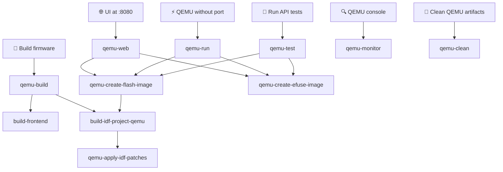

# WB-MGE QEMU Emulation Guide

## 🚀 Quick Start

Install QEMU:
https://docs.espressif.com/projects/esp-idf/en/stable/esp32/api-guides/tools/qemu.html

Run the WB-MGE firmware in QEMU with web access:

```bash
make qemu-web
```

**Web Interface:** http://localhost:8080
**Login / Password:** admin / admin

## 📋 What It Does

The Makefile activates the EIM environment automatically — no manual `source` needed.

The command automatically:
1. Recompiles QEMU firmware if sources changed (incremental, does NOT rebuild frontend)
2. Generates QEMU flash image
3. Kills any existing QEMU processes
4. Starts QEMU with port forwarding (localhost:8080 → ESP32:80)

## 🔗 Make Dependency Graph



- `qemu-build` — full build target (frontend + firmware)
- `qemu-create-flash-image` — depends on `build-idf-project-qemu`: compiles QEMU firmware (incremental) then merges into a single .bin
- `qemu-apply-idf-patches` — called automatically by `build-idf-project-qemu`: applies idempotent patches to IDF source files required for QEMU builds (UART teardown fix bug01, OpenEth ISR DRAM log fix bug04, LACT timer NULL ISR guard bug05) via patches/apply_idf_patch.py
- `qemu-create-efuse-image` — no dependencies: creates the eFuse image once
- `qemu-web`, `qemu-run`, `qemu-test` — always compile QEMU firmware (incremental, fast if nothing changed) before running
- `qemu-monitor` — no dependencies: connects to an already-running QEMU instance
- `qemu-clean` — removes build/ and sdkconfig.qemu\_build

## 🔧 Key Implementation Details

### QEMU-Specific Files
- `main/ethernet_qemu.c` - OpenEth driver for QEMU networking
- `main/wifi_qemu_mock.c` - WiFi functionality mock
- `main/hardware_mocks_qemu.c` - Hardware component mocks
- `sdkconfig.qemu.minimal` - base QEMU-compatible configuration (auto-generated, do not edit)
- `sdkconfig.qemu.extra` - extra overrides applied on top of minimal (`CONFIG_HTTPD_WS_SUPPORT`, `CONFIG_SPIRAM`)

### Critical Configuration Changes
```
CONFIG_ESPTOOLPY_FLASHMODE_DIO=y          # QEMU requires DIO, not QIO
CONFIG_SPI_FLASH_BROWNOUT_RESET=n         # Disable hardware-specific feature
CONFIG_SPI_FLASH_DANGEROUS_WRITE_ALLOWED=y # Allow QEMU flash operations
CONFIG_ETH_USE_OPENETH=y                  # Enable OpenEth for QEMU
```

### Networking in QEMU
- **Ethernet:** OpenEth driver provides network connectivity
- **WiFi:** Mocked (no actual WiFi in QEMU)
- **IP Address:** Assigned via DHCP (typically 10.0.2.15)
- **Port Forwarding:** localhost:8080 forwards to ESP32 port 80

## IO state bus (UDP 5570)

In the QEMU build the real hardware-logic modules (indication / leds_control /
rs485_control / mio_control / config_button) run against a virtual (RAM-backed)
GPIO expander and virtual native GPIO. Pin-state changes are mirrored to the host
over a UDP side-channel on **port 5570**, and the host can inject the config-button
input. (Hardware builds are unaffected.)

### Message format
Each datagram is exactly **5 ASCII bytes**: `<T><NN>/<L>` (an optional trailing
`\n` is tolerated). Parsing is positional.

- `T` — `E` = expander pin, `G` = native ESP32 GPIO level, `D` = native GPIO
  direction, `V` = native GPIO direction violation.
- `NN` — zero-padded 2-digit number (expander `00`..`15`; native `04`, `15`, `34`).
- `/` — literal separator, always at index 3.
- `X` (index 4) — for `E`/`G` the RAW physical pin level (`0`/`1`, including LED
  inversion, exactly as written); for `D` the direction (`1` OUTPUT, `0` INPUT);
  for `V` the violation cause (`0` host wrote an OUTPUT pin, `1` firmware wrote an
  INPUT pin, `2` either side operated an UNCONFIGURED pin).

### Expander pin map (`E00`..`E15`)
| Pin | Signal |
|-----|--------|
| E00 | RS485-1 terminator |
| E01 | RS485-2 terminator |
| E02 | RS485-1 fail-safe pull-up |
| E03 | RS485-2 fail-safe pull-up |
| E04 | WiFi LED (inverted: raw 0 = LED on) |
| E05 | Ethernet LED (inverted: raw 0 = LED on) |
| E06 | RS485 bus VOut |
| E07 | Status LED |
| E08 | MIO (IO bus) disable/reset |

Only pins 0–8 are wired, but all 16 bits are tracked and emitted.

### Native GPIO
- `G04` / `G15` — RS485-1 / RS485-2 direction (DE). Only the software-driven
  `tx_disabled` state is observable here (`0` = TX disabled, `1` = TX enabled);
  per-frame automatic DE toggling via UART RTS is **not** emulated by QEMU.
- `G34` — config button input. Send `G34/0` to **press** (raw LOW), `G34/1` to
  **release** (raw HIGH). Default is released.

### Native GPIO direction model (`D` / `V` records)

A native pin's direction is **derived from the firmware's real ESP-IDF GPIO
config** — there are **no hardcoded defaults**. The QEMU build links with
`-Wl,--wrap=` for `gpio_config`, `gpio_set_direction`, `gpio_reset_pin`,
`gpio_set_level`, `gpio_get_level` and `uart_set_pin` (see
`main/qemu/gpio_shim_qemu.c`): the SAME firmware code configures both real and
emulated pins, and the wrap shim mirrors each call into the virtual model so the
two stay in sync automatically. Direction is read from the mode bits:
output-capable → `OUTPUT`, else input-capable → `INPUT`, else (`GPIO_MODE_DISABLE`)
→ `UNCONFIGURED`. A pin stays `UNCONFIGURED` (and emits no `D`/`G` records) until
the firmware actually configures it. Expander (`E`) pins have no direction model.

In practice the firmware's own config produces:

| Pin | Direction (from real config) | Set by |
|-----|------------------------------|--------|
| `D04` (G04 RS485-1 DE) | `1` OUTPUT | `serial.c` `uart_set_pin(...rts=G04...)` |
| `D15` (G15 RS485-2 DE) | `1` OUTPUT | `serial.c` `uart_set_pin(...rts=G15...)` |
| `D34` (G34 config button) | `0` INPUT | `config_button.c` `gpio_config(GPIO_MODE_INPUT)` |

`D<NN>/<d>` records are emitted on a direction change and in the full dump
(`d=1` OUTPUT, `d=0` INPUT), only for pins currently configured. The model
enforces three rules **non-fatally**:

- Host writes a `G` record for an **OUTPUT** pin → violation `V<NN>/0`, write
  **rejected** (level unchanged).
- Firmware drives an **INPUT** pin → violation `V<NN>/1`, write **rejected**.
- Either side operates an **UNCONFIGURED** pin → violation `V<NN>/2`, write
  **rejected**.

A violation logs an `ESP_LOGE`, emits the `V` record and leaves the level alone;
it never aborts/crashes QEMU. Host tests treat any `V` record as a failure.

### Direction & peer learning (important)
QEMU usermode networking only NATs host→guest, so the firmware must learn the
host's address before it can send. **The host must send at least one datagram
first** (e.g. `G34/1`); the firmware learns the source address and starts
emitting state changes back to it. On the first datagram from a (new) peer the
firmware immediately sends a full state dump: all 16 expander `E` records, plus
`D<NN>` (direction) and `G<NN>` (level) for every native pin the firmware has
actually configured as INPUT or OUTPUT (driven by the real gpio config — there
is no hardcoded pin list). The ~1 Hz status-LED blink keeps the NAT mapping warm.

## 🛠️ Make Targets Reference

```bash
make qemu-apply-idf-patches  # Apply IDF source patches for QEMU builds via patches/apply_idf_patch.py (called automatically; idempotent)
make apply-idf-patches       # Apply IDF source patches for hardware builds via patches/apply_idf_patch.py (called automatically by build-idf-project; idempotent)
make qemu-build              # Build frontend + QEMU firmware (run once, or after code changes)
make qemu-create-flash-image # Compile QEMU firmware (incremental) and merge into qemu_flash.bin
make qemu-create-efuse-image # Create build/qemu_efuse.bin if missing (idempotent)
make qemu-web                # Compile firmware + create images, then run QEMU with web UI
make qemu-run                # Compile firmware + create images, then run QEMU basic mode
make qemu-monitor            # Connect monitor to already-running QEMU (no build at all)
make qemu-test               # Compile firmware + create images, then run pytest suite
make qemu-coverage           # Build instrumented firmware, run tests (no reboot), pull /gcov, build coverage report
make qemu-bin-path           # Print path to qemu-system-xtensa binary
make qemu-clean              # Remove build/ and sdkconfig.qemu_build
```

## Firmware code coverage (`make qemu-coverage`)

`make qemu-coverage` builds an end-to-end branch-coverage report for the `main/`
component, showing which branches the e2e API suite exercised in QEMU.

What it does:

1. Builds the QEMU firmware with gcov instrumentation (`COVERAGE=1` → `--coverage
   -fprofile-info-section` + `COVERAGE_BUILD`), which exposes an unauthenticated
   `GET /gcov` endpoint (registered only in coverage builds).
2. Runs the e2e API suite. The reboot tests (`14_test_reboot.py`,
   `22_test_ota.py`, `30_test_wifi_perm_disable.py`, `33_test_auth_settings.py`,
   `40_test_web_port.py`, `42_test_sniffer_cache_overlays_e2e.py`) are
   **excluded**, because a reboot zeroes the in-RAM gcov counters.
3. After the session (before QEMU shuts down), pytest pulls `GET /gcov` and saves
   the streamed `.gcda` data to `build/coverage.stream`.
4. The `qemu-coverage-report` step reconstructs the `.gcda` files with
   `xtensa-esp-elf-gcov-tool merge-stream` and runs `gcovr` to produce the report.

Output: HTML report at `build/qemu_coverage/index.html`, text summary at
`build/qemu_coverage/summary.txt`.

You can regenerate the report from an existing stream without re-running QEMU:
`make qemu-coverage-report`.

## Combined coverage (`make coverage-combined`)

`make coverage-combined` merges the host **unit-test** coverage with the QEMU
**e2e** firmware coverage into a single report, so you can see which lines of the
`main/` component are exercised by either layer.

The two datasets come from different compilers (unit tests: host gcc/clang; QEMU
firmware: xtensa-esp-elf gcc). Their raw `.gcno/.gcda` are version-incompatible
and cannot be merged with `gcov-tool`; they are merged at the gcovr JSON-tracefile
level instead.

Three-step flow (the combined target only merges existing tracefiles — it does
not re-run the suites):

```bash
make coverage           # unit-test tracefiles  -> unittests/*/covr_report/**/*_covr.json
make qemu-coverage      # e2e tracefile         -> build/qemu_coverage/qemu_covr.json
make coverage-combined  # merge -> build/combined_coverage/index.html
```

Output: HTML report at `build/combined_coverage/index.html`, text summary at
`build/combined_coverage/summary.txt`.

**Caveat:** line and function coverage merge as a true union (covered by the unit
tests **or** the e2e suite). Branch coverage does **not** merge cleanly: the two
compilers instrument branches differently on the same source line (different branch
count and numbering), so gcovr cannot match them up — the per-line branches end up
adding together instead of overlapping. The combined report is therefore
authoritative for line/function coverage, while combined branch numbers are
indicative only.

## 🌐 Web Interface Features

Once running, access these endpoints:
- **Main Interface:** http://localhost:8080
- **System Info:** http://localhost:8080/info
- **Settings:** http://localhost:8080/settings
- **WiFi Scan Start:** http://localhost:8080/wifi_scan/start
- **WiFi Scan Results:** http://localhost:8080/wifi_scan/results
- **Firmware Update:** http://localhost:8080/update

## 🔍 Troubleshooting

### No Web Access
1. Check QEMU is running with port forwarding: `pgrep -af qemu-system-xtensa`
2. Verify port forwarding: should include `hostfwd=tcp:127.0.0.1:8080-:80`
3. Check ESP32 got IP address in QEMU logs: `eth ip: 10.0.2.15`

### Stale QEMU Process (port already in use)
If `make qemu-test` or `make qemu-web` fails with `Could not set up host forwarding rule`:
```bash
pkill -9 -f qemu-system-xtensa
```
Verify the process is gone: `pgrep -af qemu-system-xtensa` (must be empty)

### Running tests against an already-running QEMU
The `--qemu` pytest flag means "launch and manage QEMU yourself". If QEMU is already running
(e.g. started with `make qemu-web`), do **not** pass `--qemu` to pytest — it will detect
the occupied ports and abort. Instead, use `--ip` directly:
```bash
cd api_tests && .venv/bin/python -m pytest --ip localhost:8080
```

### QEMU Won't Start
1. Verify `build/qemu_flash.bin` exists: run `make qemu-create-flash-image` first
2. Install QEMU via `idf_tools.py`: `python $IDF_PATH/tools/idf_tools.py install qemu-xtensa`

### Build Errors
1. Clean and rebuild: `make qemu-clean && make qemu-build`
2. If switching from native to QEMU build: `make qemu-build` (the build system detects a native CMakeCache and runs `fullclean` automatically)

## ⚡ Performance Notes

- QEMU emulation is slower than real hardware
- Network operations work but with higher latency
- Hardware-specific features (GPIO expander, voltage monitoring) are mocked
- RS485 ports are present but not functional in QEMU
