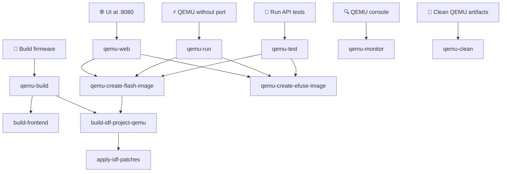

# WB-MGE QEMU Emulation Guide

## 🚀 Quick Start

Install QEMU:
https://docs.espressif.com/projects/esp-idf/en/stable/esp32/api-guides/tools/qemu.html

Run the WB-MGE firmware in QEMU with web access:

```bash
make qemu-web
```

**Web Interface:** http://localhost:8080
**Login / Password:** admin / admin

## 📋 What It Does

The Makefile activates the EIM environment automatically — no manual `source` needed.

The command automatically:
1. Recompiles QEMU firmware if sources changed (incremental, does NOT rebuild frontend)
2. Generates QEMU flash image
3. Kills any existing QEMU processes
4. Starts QEMU with port forwarding (localhost:8080 → ESP32:80)

## 🔗 Make Dependency Graph



- `qemu-build` — full build target (frontend + firmware)
- `qemu-create-flash-image` — depends on `build-idf-project-qemu`: compiles QEMU firmware (incremental) then merges into a single .bin
- `apply-idf-patches` — called automatically by `build-idf-project-qemu`: applies idempotent patches to IDF source files required for QEMU builds (UART teardown fix, OpenEth ISR DRAM log fix)
- `qemu-create-efuse-image` — no dependencies: creates the eFuse image once
- `qemu-web`, `qemu-run`, `qemu-test` — always compile QEMU firmware (incremental, fast if nothing changed) before running
- `qemu-monitor` — no dependencies: connects to an already-running QEMU instance
- `qemu-clean` — removes build/ and sdkconfig.qemu\_build

## 🔧 Key Implementation Details

### QEMU-Specific Files
- `main/ethernet_qemu.c` - OpenEth driver for QEMU networking
- `main/wifi_qemu_mock.c` - WiFi functionality mock
- `main/hardware_mocks_qemu.c` - Hardware component mocks
- `sdkconfig.qemu.minimal` - base QEMU-compatible configuration (auto-generated, do not edit)
- `sdkconfig.qemu.extra` - extra overrides applied on top of minimal (`CONFIG_HTTPD_WS_SUPPORT`, `CONFIG_SPIRAM`)

### Critical Configuration Changes
```
CONFIG_ESPTOOLPY_FLASHMODE_DIO=y          # QEMU requires DIO, not QIO
CONFIG_SPI_FLASH_BROWNOUT_RESET=n         # Disable hardware-specific feature
CONFIG_SPI_FLASH_DANGEROUS_WRITE_ALLOWED=y # Allow QEMU flash operations
CONFIG_ETH_USE_OPENETH=y                  # Enable OpenEth for QEMU
```

### Networking in QEMU
- **Ethernet:** OpenEth driver provides network connectivity
- **WiFi:** Mocked (no actual WiFi in QEMU)
- **IP Address:** Assigned via DHCP (typically 10.0.2.15)
- **Port Forwarding:** localhost:8080 forwards to ESP32 port 80

## 🛠️ Make Targets Reference

```bash
make apply-idf-patches       # Apply IDF source patches for QEMU builds (called automatically; idempotent)
make qemu-build              # Build frontend + QEMU firmware (run once, or after code changes)
make qemu-create-flash-image # Compile QEMU firmware (incremental) and merge into qemu_flash.bin
make qemu-create-efuse-image # Create build/qemu_efuse.bin if missing (idempotent)
make qemu-web                # Compile firmware + create images, then run QEMU with web UI
make qemu-run                # Compile firmware + create images, then run QEMU basic mode
make qemu-monitor            # Connect monitor to already-running QEMU (no build at all)
make qemu-test               # Compile firmware + create images, then run pytest suite
make qemu-bin-path           # Print path to qemu-system-xtensa binary
make qemu-clean              # Remove build/ and sdkconfig.qemu_build
```

## 🌐 Web Interface Features

Once running, access these endpoints:
- **Main Interface:** http://localhost:8080
- **System Info:** http://localhost:8080/info
- **Settings:** http://localhost:8080/settings
- **WiFi Scan Start:** http://localhost:8080/wifi_scan/start
- **WiFi Scan Results:** http://localhost:8080/wifi_scan/results
- **Firmware Update:** http://localhost:8080/update

## 🔍 Troubleshooting

### No Web Access
1. Check QEMU is running with port forwarding: `pgrep -af qemu-system-xtensa`
2. Verify port forwarding: should include `hostfwd=tcp:127.0.0.1:8080-:80`
3. Check ESP32 got IP address in QEMU logs: `eth ip: 10.0.2.15`

### Stale QEMU Process (port already in use)
If `make qemu-test` or `make qemu-web` fails with `Could not set up host forwarding rule`:
```bash
pkill -9 -f qemu-system-xtensa
```
Verify the process is gone: `pgrep -af qemu-system-xtensa` (must be empty)

### Running tests against an already-running QEMU
The `--qemu` pytest flag means "launch and manage QEMU yourself". If QEMU is already running
(e.g. started with `make qemu-web`), do **not** pass `--qemu` to pytest — it will detect
the occupied ports and abort. Instead, use `--ip` directly:
```bash
cd api_tests && .venv/bin/python -m pytest --ip localhost:8080
```

### QEMU Won't Start
1. Verify `build/qemu_flash.bin` exists: run `make qemu-create-flash-image` first
2. Install QEMU via `idf_tools.py`: `python $IDF_PATH/tools/idf_tools.py install qemu-xtensa`

### Build Errors
1. Clean and rebuild: `make qemu-clean && make qemu-build`
2. If switching from native to QEMU build: `make qemu-build` (the build system detects a native CMakeCache and runs `fullclean` automatically)

## ⚡ Performance Notes

- QEMU emulation is slower than real hardware
- Network operations work but with higher latency
- Hardware-specific features (GPIO expander, voltage monitoring) are mocked
- RS485 ports are present but not functional in QEMU
